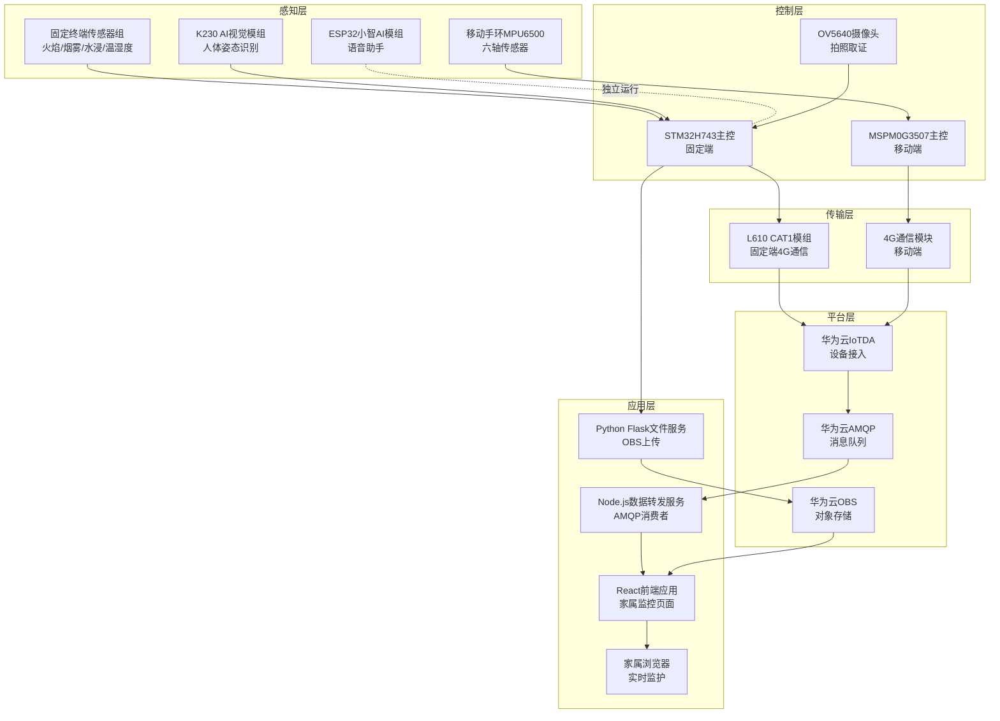

# ⚡ 独居老人双终端智慧监护系统
> 赛事：全国大学生物联网设计竞赛（广和通 IoT 赛道）
> 年份：2026
> 平台：STM32H743 / MSPM0G3507 / 广和通 L610 CAT1 / 嘉楠 K230 / ESP32
> 团队：stm32H743 小队 · 厦门大学

## 📖 作品简介
本系统以「老人零感知、子女全掌握、隐患早处置」为核心理念，采用「固定终端 + 移动手环」双机协同架构，为独居老人构建居家 + 户外全场景安全监护闭环。固定端基于 STM32H743 主控，集成火焰、烟雾、水浸、温湿度等多维传感器，实现燃气泄漏、火灾、水浸等居家安全隐患的 7×24 小时无感监测；并通过 K230 AI 视觉模组实现室内跌倒检测、OV5640 摄像头拍照取证。移动端基于 MSPM0G3507 主控，通过 MPU6500 六轴传感器实现户外摔倒检测。双端通过广和通 L610 CAT1 模组经 4G 网络接入华为云 IoTDA，实现数据上报与双向联动，家属可通过网页端监控平台实时掌握老人状态，形成完整的安全保障闭环。

## 🧠 核心功能
- **居家安全监测**：火焰、烟雾、水浸、温湿度多维传感器 7×24 小时无感监测
- **跌倒检测**：K230 AI 视觉（室内）+ MPU6500 六轴（户外）双模互补，检测-确认-报警全链路
- **拍照取证**：OV5640 摄像头拍照并经 4G 上传至华为云 OBS 对象存储
- **语音陪伴**：ESP32 小智 AI 语音助手，提供聊天、天气查询、音乐娱乐等情感陪伴
- **双端联动**：固定端与移动端通过 4G 云端双向联动，覆盖居家与户外全场景
- **网页监控**：React 前端实时显示传感器数据与照片，家属远程监护

## 🏗️ 系统架构
系统采用「固定终端 + 移动手环 + 网页端监控平台 + 华为云平台」四端协同架构，遵循物联网五层架构：



## 📂 目录结构
```text
├── README.md               # 项目说明文件
├── docs/                   # 项目文档、设计报告
│   ├── 项目书.md           # 项目设计书（Markdown）
│   └── stm32H743_*.docx    # 项目设计书（Word）
├── firmware/               # 设备底层固件源码
│   ├── fixed-terminal/     # 固定端固件（STM32H743 + L610 CAT1）
│   └── mobile-terminal/    # 移动端固件（MSPM0G3507 + MPU6500）
├── edge_computing/         # 边缘计算与智能算法
│   └── elderly_fall_detection.py  # K230 跌倒检测算法
└── cloud/                  # 云端平台服务
    └── web_frontend/       # 网页端监控平台（Flask + React）
```

## 🚀 快速开始

```bash
git clone https://github.com/Fiborn/fibocom-iot-2026-smart-elderly-care-system.git
cd fibocom-iot-2026-smart-elderly-care-system
```

- **固定端**：使用 Keil MDK-ARM 打开 `firmware/fixed-terminal/MDK-ARM/*.uvprojx` 编译烧录
- **移动端**：使用 TI Code Composer Studio 导入 `firmware/mobile-terminal/` 工程
- **边缘算法**：将 `edge_computing/elderly_fall_detection.py` 部署至 K230 模组
- **网页端**：进入 `cloud/web_frontend/`，按 `smart-elderly-monitoring-dashboard/DEV-GUIDE.md` 配置并启动前后端
