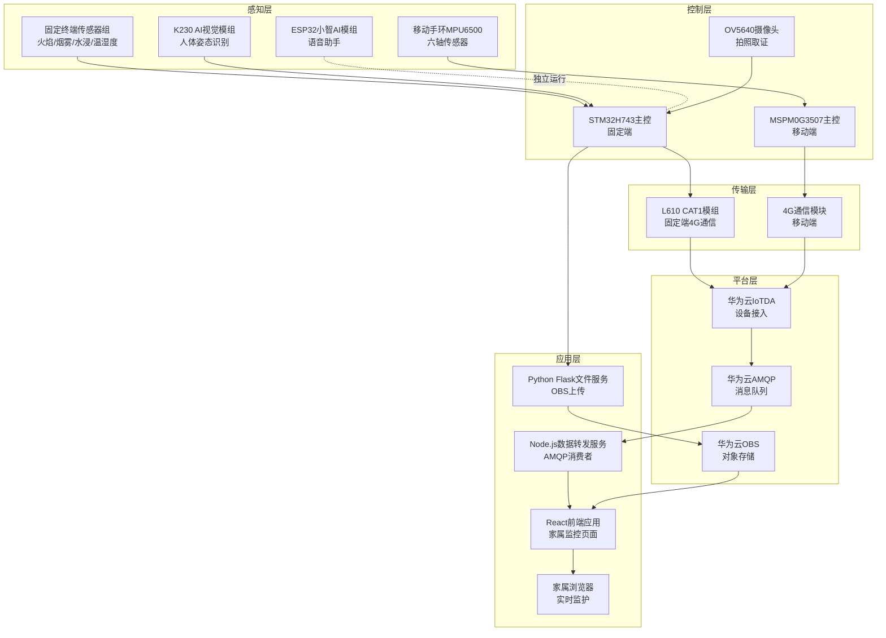
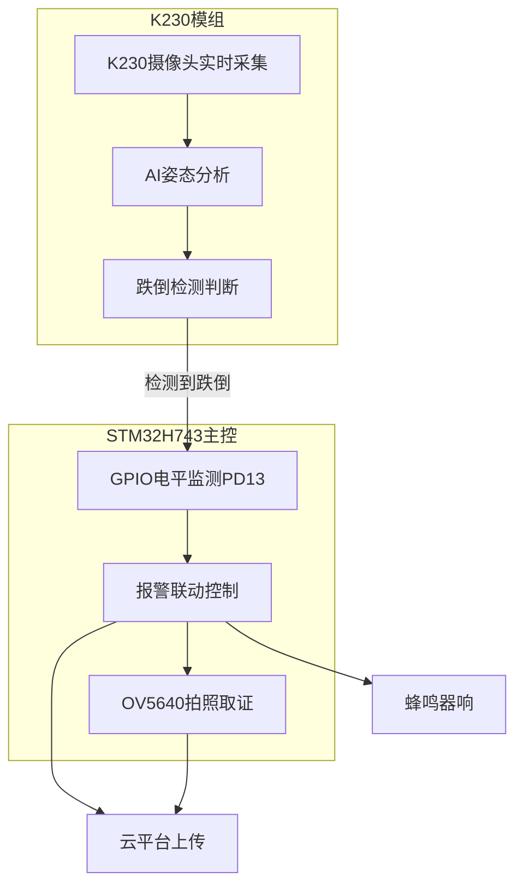
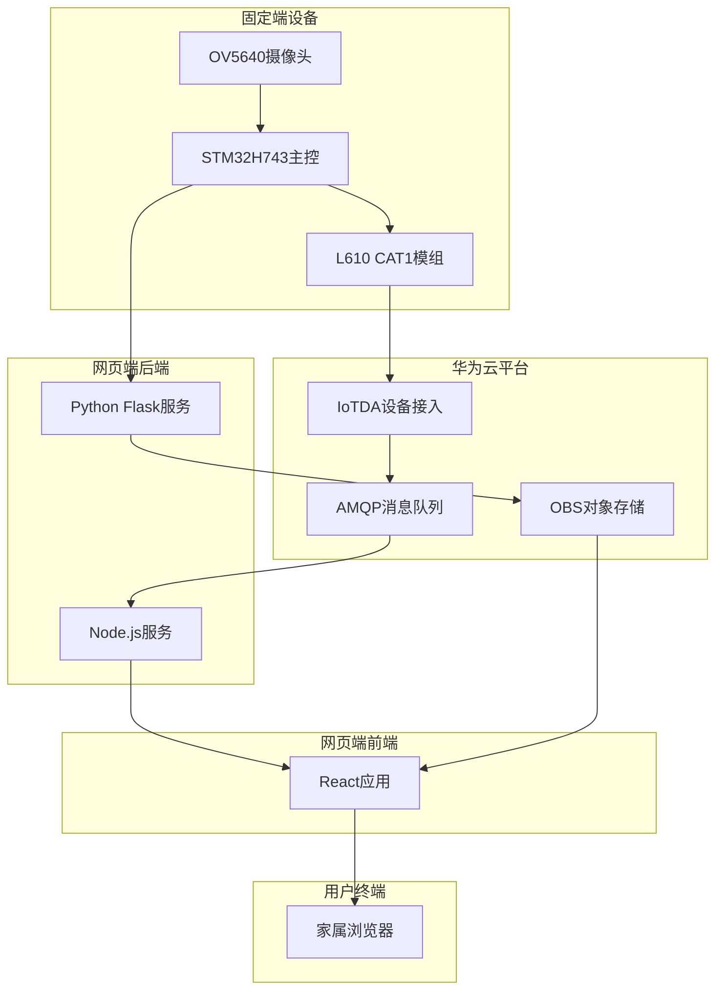
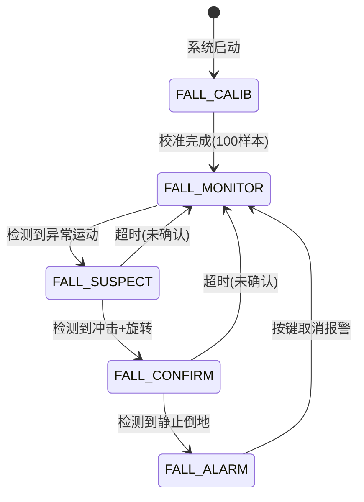

# 独居老人双终端智慧监护系统项目书

## 一、项目概述

### 1.1 项目背景

我国已进入深度老龄化社会阶段。根据国家统计局数据，2023年末我国60岁及以上老年人口已达2.97亿，占总人口的21.1%，其中城乡独居老人数量超过2600万。独居老人面临居家安全隐患（燃气泄漏、失火、水管爆裂）、人身安全风险（户外摔倒）、精神健康风险（长期独处孤独）三大核心问题。

现有市场产品（如烟感报警器、老年手机、GPS追踪器）呈碎片化分布，各设备独立运作，缺乏联动与整合，无法形成完整的安全保障闭环，且普遍存在操作复杂、老人接受度低、依赖WiFi网络等问题。

### 1.2 项目目标

本系统以"老人零感知、子女全掌握、隐患早处置"为核心设计理念，实现以下目标：

- **居家安全兜底**：对燃气、火灾、水浸等居家安全隐患实现7×24小时无感化自动监测
- **户外生命守护**：摔倒后完成检测-确认-报警全链路，黄金救援时间内触达家属
- **情感陪伴补充**：通过AI语音交互缓解老人孤独感，提供日常信息服务
- **双端联动闭环**：固定终端与移动手环通过4G云端实现双向联动，形成居家+户外全场景覆盖

### 1.3 技术定位

系统严格贴合全国大学生物联网设计竞赛广和通IoT赛道命题要求：

- **主控**：STM32通用MCU（固定端STM32H743，移动端MSPM0G3507）
- **传输**：广和通L610 CAT1模组作为唯一的4G通信通道
- **架构分层**：L610仅作为纯4G透传通道，所有数据处理和算法运行均在主控MCU完成

***

## 二、系统架构设计

### 2.1 整体架构

系统采用"固定终端 + 移动手环 + 网页端监控平台 + 华为云平台"四端协同架构，遵循物联网五层架构：



**架构说明**：

| 层级      | 组件               | 功能                | 技术特点                          |
| ------- | ---------------- | ----------------- | ----------------------------- |
| **感知层** | 固定端传感器组          | 火焰、烟雾、水浸、温湿度检测    | 多维环境监测，ADC+数字双路输出             |
| <br />  | 移动端MPU6500       | 六轴运动数据采集          | 软件I2C，125Hz采样率                |
| <br />  | K230 AI视觉模组      | 人体姿态识别、跌倒检测       | Lightweight OpenPose模型，95%准确率 |
| <br />  | ESP32小智AI模组      | 语音助手、娱乐陪伴         | 独立运行，MCP音乐控制协议                |
| **控制层** | STM32H743主控      | 固定端数据处理、设备联动      | 480MHz，双摄像头架构                 |
| <br />  | MSPM0G3507主控     | 移动端摔倒检测、状态上报      | 32MHz，低功耗设计                   |
| <br />  | OV5640摄像头        | 拍照取证、实时预览         | DCMI接口，JPEG编码                 |
| **传输层** | L610 CAT1模组      | 固定端4G通信           | MQTT协议，华为云接入                  |
| <br />  | 4G通信模块           | 移动端4G通信           | JSON数据上报                      |
| **平台层** | 华为云IoTDA         | 设备接入、物模型管理        | AMQP规则引擎推送                    |
| <br />  | 华为云AMQP          | 消息队列              | Node.js消费者订阅                  |
| <br />  | 华为云OBS           | 图片对象存储            | 分段上传、签名URL                    |
| **应用层** | Node.js数据转发服务    | AMQP消息消费、HTTP接口提供 | Rhea库，实时转发                    |
| <br />  | Python Flask文件服务 | 图片上传、OBS操作        | 分块上传（普通+分段）                   |
| <br />  | React前端应用        | 家属监控页面            | 轮询更新、数据可视化                    |
| <br />  | 家属浏览器            | 实时环境监护、摄像头查看      | 自动刷新、事件记录                     |

**四端协同机制**：

1. **固定端（STM32H743）**：
   - 实时采集火焰、烟雾、水浸等环境数据
   - K230 AI视觉检测老人跌倒（GPIO触发）
   - OV5640拍照取证并上传至OBS
   - ESP32小智AI提供娱乐陪伴（独立运行）
2. **移动端（MSPM0G3507）**：
   - MPU6500采集六轴运动数据
   - 摔倒检测算法（失重-冲击-静止）
   - 4G通信模块上报状态
3. **华为云平台**：
   - IoTDA接收双端数据（MQTT协议）
   - AMQP推送到Node.js后端（规则引擎）
   - OBS存储固定端上传的照片
4. **网页端监控平台**：
   - Node.js后端消费AMQP消息，提供HTTP接口
   - Python Flask后端处理图片上传，操作OBS
   - React前端轮询后端接口，实时显示传感器数据和照片
   - 家属浏览器访问监控页面，实时掌握老人状态

**数据流向**：

```
环境数据：传感器 → STM32H743 → L610 → IoTDA → AMQP → Node.js → React → 家属
摔倒检测：K230摄像头 → K230 AI → GPIO → STM32H743 → 报警联动
拍照取证：OV5640 → STM32H743 → Base64编码 → Flask → OBS → React → 家属
移动端：MPU6500 → MSPM0G3507 → 4G通信模块 → IoTDA → AMQP → Node.js → React → 家属
语音陪伴：老人语音 → ESP32小智AI → 本地对话/云端API → 音乐播放（独立闭环）
```

### 2.2 固定终端架构

**硬件平台**：STM32H743VIT6 (Cortex-M7, 480MHz, 1MB SRAM, 2MB Flash)

**核心外设**：

- OV5640摄像头（DCMI + DMA2D）
- 7寸LCD触摸屏（800×480，LTDC接口）
- SDRAM显存（32MB，FMC接口）
- SD卡存储（SDMMC + FATFS）

**传感器模块**：

- 火焰检测：红外火焰传感器（PB0 DO + PB1 AO）
- 烟雾检测：MQ-2传感器（PB3 DO + PA7 AO）
- 水浸检测：电极式水浸传感器（PB2）
- 温湿度检测：DHT11传感器（PA15)
- 紧急按键：防水大按键（PF6）

**AI视觉模块**：

- K230 AI视觉模组（嘉楠科技，RISC-V双核架构）
- K230自带摄像头：负责实时人体姿态识别与跌倒检测
- GPIO输出跌倒检测结果（PD13）到主控

**双摄像头架构**：

- OV5640摄像头（连接STM32H743，DCMI接口）：负责拍摄照片
- K230摄像头（连接K230模组）：负责摔倒检测AI推理

**语音助手模块（独立）**：

- ESP32小智AI模组（类小爱同学智能语音助手）
- 独立运行，不与STM32主控通信
- 实时语音交互：聊天对话、查询天气、讲笑话等
- 音乐娱乐控制：通过MCP协议播放音乐、戏剧等
- 丰富老人闲暇生活，提供情感陪伴

**通信模块**：

- 广和通L610 CAT1模组（UART4，波特率115200）
- 华为云IoT平台连接（MQTT协议）

### 2.3 移动终端架构

**硬件平台**：MSPM0G3507 (Cortex-M0+, 32MHz, 8KB SRAM, 64KB Flash)

**核心外设**：

- MPU6500六轴传感器（软件I2C，PA28/PA31）
- LED指示灯（PB14）
- 蜂鸣器（PB7）
- SOS按键（PB8，外部中断）

**通信模块**：

- 4G通信模块
- 4G数据上报（JSON格式）

***

## 三、固定端详细设计

### 3.1 系统初始化流程

```
系统启动
    ├─ MPU配置（SDRAM缓存使能）
    ├─ 时钟配置（480MHz主频）
    ├─ 外设初始化
    │   ├─ GPIO/UART/DMA初始化
    │   ├─ SDRAM初始化（32MB）
    │   ├─ LCD触摸屏初始化
    │   └─ OV5640摄像头初始化
    ├─ 传感器初始化
    │   ├─ 火焰/烟雾/水浸传感器GPIO初始化
    │   ├─ ADC初始化（16位精度）
    │   ├─ DHT11温湿度传感器初始化
    │   ├─ DS1302实时时钟初始化
    │   └─ K230跌倒检测GPIO初始化（PD13）
    ├─ 文件系统初始化
    │   ├─ SD卡挂载（FATFS）
    │   └─ 容量检测
    ├─ 音频系统初始化
    │   ├─ I2C音频编解码初始化
    │   └─ WAV播放器初始化
    └─ 云平台连接
        ├─ UART4初始化（L610通信）
        ├─ AT指令初始化流程
        ├─ 4G网络注册
        └─ 华为云MQTT连接
```

### 3.2 传感器数据采集模块

#### 3.2.1 火焰检测

**实现方式**：

- **数字输出（DO）**：PB0引脚输入，低电平触发
- **模拟输出（AO）**：ADC1通道5（PB1），16位采样，阈值30000

**检测逻辑**：

```c
uint8_t flame_flag = Flame_DO_Detect();           // 数字量检测
uint16_t adc_flame = Sensors_ADC_Read(ADC_CH_FLAME); // 模拟量读取
uint8_t fire_warn = flame_flag || (adc_flame < FLAME_AO_THRESHOLD);
```

**采样周期**：100ms

#### 3.2.2 烟雾检测（MQ-2）

**实现方式**：

- **数字输出（DO）**：PB3引脚输入，低电平触发
- **模拟输出（AO）**：ADC1通道7（PA7），16位采样，阈值20000

**联动控制**：

- 烟雾检测触发后，延迟300ms启动继电器（风扇）
- 烟雾消失后，延迟3秒关闭继电器
- 继电器控制引脚：PA5

#### 3.2.3 水浸检测

**实现方式**：

- 电极式传感器，PB2引脚输入
- 低电平表示检测到漏水

**检测逻辑**：

```c
uint8_t rain_flag = Rain_Detect(); // 低电平=检测到水
```

#### 3.2.4 温湿度检测（DHT11）

**接口**：单总线协议
**数据格式**：温度（整数）+ 湿度（整数）
**采样周期**：200ms（结合传感器数据上传）

### 3.3 云平台通信模块

#### 3.3.1 L610 CAT1模组初始化

**AT指令流程**：

```
AT                          // 模组测试
AT+CPIN?                    // SIM卡检测
AT+CSQ?                     // 信号强度查询
AT+CGREG?                   // 网络注册
AT+MIPCALL=1                // 激活PDP上下文
AT+HMCON=0,60,<服务器地址>,<端口>,<设备ID>,<密码>  // 华为云MQTT连接
AT+HMSUB=0,<Topic>          // 订阅属性上报Topic
```

**初始化超时处理**：

- 每个AT指令超时后重试
- 初始化失败后延迟500ms重试
- 直到成功连接云平台

#### 3.4.2 传感器数据上报

**数据格式**：JSON

```json
{
  "services": [{
    "service_id": "sensor_data",
    "properties": {
      "flame_flag": 0,
      "smoke_flag": 0,
      "rain_flag": 0,
      "k230": 0,
      "temperature": 25.5,
      "humidity": 60.2,
      "adc_flame": 45000,
      "adc_smoke": 15000,
      "help_flag": 0
    }
  }]
}
```

**上报周期**：2秒（sensor\_cnt % 20 == 0）

#### 3.4.3 照片上传功能

**分块上传流程**：

```
CLOUD_HTTP_OPEN_FILE      // 打开SD卡照片文件
    ↓
CLOUD_HTTP_PREPARE_CHUNK  // 读取6KB原始数据
    ↓
CLOUD_HTTP_SET_URL        // 设置HTTP URL
    ↓
CLOUD_HTTP_SET_CONTYPE    // 设置Content-Type: application/json
    ↓
CLOUD_HTTP_SEND_DATA_CMD  // 发送AT+HTTPDATA=<length>
    ↓
CLOUD_HTTP_SEND_JSON      // 发送Base64编码的JSON数据
    ↓
CLOUD_HTTP_ACT            // 执行HTTP POST请求
    ↓
CLOUD_HTTP_WAIT_RESULT    // 等待服务器响应
    ↓
CLOUD_HTTP_PREPARE_CHUNK  // 循环处理下一个分块
```

**关键技术**：

- Base64编码：将6KB原始数据编码为8KB Base64字符串
- JSON封装：`{"filename":"photo.jpg","chunk_index":0,"total_chunks":10,"image_data":"..."}`
- 分块上传：支持大文件分多次上传
- 错误重试：每个分块最多重试1次

#### 3.4.4 语音通话功能

**拨打电话流程**：

```c
uint8_t Cloud_MakeCall(const char *phone_number) {
    // 1. 检查当前状态（是否有正在进行的通话或上传）
    if (g_call_active != 0U || Cloud_IsBusy() != 0U) {
        return 0;
    }

    // 2. 准备语音通话配置
    Cloud_PrepareVoiceCall();  // 设置音量、来电显示等

    // 3. 发送拨号命令
    snprintf(dial_cmd, sizeof(dial_cmd), "ATD%s;\r\n", phone_number);
    Cloud_SendCommandAndWait(dial_cmd, "OK", NULL, NULL, 5000);

    // 4. 等待通话建立（查询CLCC状态）
    Cloud_WaitForCallProgress(10000);

    // 5. 标记通话激活
    Cloud_SetCallActive(1U);
    return 1;
}
```

**挂断电话**：

```c
void Cloud_HangupCall(void) {
    Cloud_SendCommandAndWait("ATH\r\n", "OK", NULL, NULL, 3000);
    Cloud_SetCallActive(0U);
}
```

### 3.4 UI交互模块

#### 3.4.1 多模式切换

**三种UI模式**：

| 模式     | ui\_mode值 | 功能                   |
| ------ | --------- | -------------------- |
| 预览模式   | 0         | 实时摄像头预览，等待K230摔倒检测触发 |
| 照片拍摄模式 | 1         | 拍照、照片预览、保存到SD卡       |
| 相册模式   | 2         | 浏览已拍摄的照片，支持删除        |

**模式切换逻辑**：

```c
// 预览模式 → 照片拍摄模式
if (touch_x >= 645 && touch_x <= 795 && touch_y >= 120 && touch_y <= 210) {
    LCD_FillRect(0, 0, 640, 480, LCD_BackColor);
    ui_mode = 1;
    UI_DrawRecordPanel();
    DCMI_SetMode_Video();  // 切换到视频流模式
}

// 照片拍摄模式 → 预览模式
if (touch_y >= 300 && touch_y <= 390) {  // 返回预览按钮
    LCD_FillRect(0, 0, 640, 480, LCD_BackColor);
    ui_mode = 0;
    UI_DrawSwitchPanel();
    DCMI_SetMode_AI();  // 切换到预览模式
}
```

#### 3.4.2 触摸屏交互

**触摸检测**：

```c
Touch_Scan();  // 扫描触摸事件
if (touchInfo.flag && touchInfo.num > 0) {
    uint16_t touch_x = touchInfo.x[0];
    uint16_t touch_y = touchInfo.y[0];
    // 处理触摸事件
}
```

**UI元素刷新周期**：

- 时间显示：200ms检测一次秒变化
- 传感器状态：100ms检测一次变化
- 温湿度显示：2秒刷新一次

### 3.5 K230 AI视觉跌倒检测模块

#### 3.5.1 模块架构

**硬件平台**：嘉楠科技K230 AI视觉模组

**核心特性**：

- **处理器架构**：双核RISC-V处理器（大核1.8GHz + 小核0.8GHz）
- **AI算力**：内置KPU（神经网络处理器），支持INT8量化模型
- **内存配置**：256MB DDR3，支持大模型加载
- **摄像头接口**：支持MIPI CSI接口（OV5640兼容）
- **通信接口**：UART3（原设计）/ GPIO（当前实现）

**AI算法模型**：

- **模型类型**：人体姿态估计模型（OpenPose/Lightweight OpenPose）
- **检测目标**：人体17个关键骨骼点（头部、肩部、肘部、腕部、髋部、膝部、踝部等）
- **推理速度**：30 FPS（480x480分辨率）
- **模型大小**：约2MB（量化后）

#### 3.5.2 跌倒检测算法

**算法流程**：

```
摄像头实时采集画面
    ↓
图像预处理（缩放、归一化）
    ↓
人体姿态估计（KPU推理）
    ↓
骨骼关键点提取（17个点）
    ↓
姿态分析（重心位置、肢体角度）
    ↓
跌倒特征识别（速度+姿态变化）
    ↓
输出跌倒检测结果
```

**跌倒特征判据**：

1. **重心高度突变**：
   - 正常站立：重心高度在画面中上部
   - 跌倒状态：重心高度快速下降至画面下部
   - 判据：重心Y坐标变化率 > 阈值
2. **肢体角度异常**：
   - 正常站立：躯干与垂直线夹角 < 30°
   - 跌倒状态：躯干与垂直线夹角 > 60°
   - 判据：检测肩部-髋部连线与垂直线的夹角
3. **动作速度特征**：
   - 正常动作：关节点速度 < 200像素/秒
   - 跌倒动作：关节点速度 > 500像素/秒
   - 判据：连续3帧内关节点位移超过阈值
4. **跌倒后静止检测**：
   - 跌倒后：人体保持静止状态（速度 < 50像素/秒）
   - 持续时间：超过3秒
   - 目的：区分主动躺下与意外跌倒

#### 3.5.3 K230与STM32通信接口

**GPIO通信方式**：

**硬件连接**：

| K230引脚    | STM32引脚 | 信号方向         | 功能     |
| --------- | ------- | ------------ | ------ |
| GPIO\_OUT | PD13    | K230 → STM32 | 跌倒检测输出 |
| GND       | GND     | -            | 地线     |
| VCC       | 5V      | -            | 电源     |

**电平定义**：

- **低电平（0V）**：未检测到跌倒（默认状态）
- **高电平（3.3V）**：检测到跌倒，触发报警

**STM32端初始化**：

```c
void K230_Fall_GPIO_Init(void) {
    GPIO_InitTypeDef GPIO_InitStruct = {0};
    __HAL_RCC_GPIOD_CLK_ENABLE();

    GPIO_InitStruct.Pin   = K230_FALL_PIN;      // PD13
    GPIO_InitStruct.Mode  = GPIO_MODE_INPUT;    // 输入模式
    GPIO_InitStruct.Pull  = GPIO_PULLDOWN;      // 下拉电阻
    GPIO_InitStruct.Speed = GPIO_SPEED_FREQ_LOW;
    HAL_GPIO_Init(K230_FALL_PORT, &GPIO_InitStruct);

    printf("[K230] Fall detect GPIO init done (input pull-down)\r\n");
}
```

**上升沿检测逻辑**：

```c
// 主循环中检测上升沿
GPIO_PinState k230_val = HAL_GPIO_ReadPin(K230_FALL_PORT, K230_FALL_PIN);
if (k230_val == GPIO_PIN_SET && last_k230_fall_val == GPIO_PIN_RESET) {
    // 检测到上升沿，触发跌倒报警
    g_fall_alarm_active = 1;
    fall_alarm_cnt++;
    buzzer_state = 1;  // 启动蜂鸣器
    printf("[K230] Fall detected! alarm_cnt=%d\r\n", fall_alarm_cnt);

    // 自动拍照并上传
    MAIN_RequestPhotoCapture("K230");
}
last_k230_fall_val = k230_val;  // 更新历史值
```

#### 3.5.4 双摄像头架构与K230独立运行

**系统架构设计**：
固定端采用双摄像头协同架构，实现拍照与跌倒检测的分离：

| 摄像头           | 连接方式              | 功能定位          | 处理平台        |
| ------------- | ----------------- | ------------- | ----------- |
| **OV5640摄像头** | DCMI接口连接STM32H743 | 拍摄照片、实时预览     | STM32H743主控 |
| **K230摄像头**   | 独立连接K230模组        | 实时人体姿态识别、跌倒检测 | K230 AI模组   |

**架构优势**：

1. **功能分离**：OV5640专注于拍照取证，K230专注于AI推理，互不干扰
2. **低耦合设计**：K230独立运行AI算法，通过单一GPIO输出结果，不占用STM32算力
3. **简化通信**：只需一个GPIO引脚（PD13）即可完成跌倒检测通知
4. **实时性强**：K230持续进行AI推理，检测到跌倒后立即触发GPIO电平

**工作流程**：



**通信机制**：

- **GPIO电平定义**：
  - 低电平（0V）：未检测到跌倒（默认状态）
  - 高电平（3.3V）：检测到跌倒，触发报警
- **触发方式**：上升沿触发（从低电平变为高电平）
- **响应时间**：<1秒（K230检测到跌倒到STM32响应）

**对比传统方案**：

| 对比维度  | 传统单摄像头方案          | 本系统双摄像头方案       |
| ----- | ----------------- | --------------- |
| 功能冲突  | AI推理与拍照共享摄像头，可能冲突 | 功能分离，互不干扰       |
| 算力占用  | AI推理占用主控算力        | K230独立运行，主控算力充足 |
| 响应速度  | 拍照时AI推理暂停         | K230持续推理，无停顿    |
| 系统复杂度 | 较低                | 略高（需要两个摄像头）     |
| 成本    | 较低                | 略高（增加K230模组成本）  |

#### 3.5.5 数据上报与联动

**云平台数据格式**：

```json
{
  "services": [{
    "service_id": "sensor_data",
    "properties": {
      "flame_flag": 0,
      "smoke_flag": 0,
      "rain_flag": 0,
      "k230": 1,           // K230跌倒检测标志
      "temperature": 25.5,
      "humidity": 60.2,
      "adc_flame": 45000,
      "adc_smoke": 15000,
      "help_flag": 0
    }
  }]
}
```

**联动控制流程**：

```
K230检测到跌倒
    ↓
输出高电平（PD13=1）
    ↓
STM32检测到上升沿
    ↓
┌─────────────────┬──────────────────┬─────────────────┐
│ 本地报警        │ 自动取证         │ 云端通知        │
├─────────────────┼──────────────────┼─────────────────┤
│ 蜂鸣器滴滴响    │ 拍摄照片         │ 上报k230=1      │
│ (200ms间隔)     │ 保存到SD卡       │ 照片上传        │
│                 │ 时间戳记录       │ 推送家属        │
└─────────────────┴──────────────────┴─────────────────┘
    ↓
用户触摸屏幕取消报警
    ↓
重置报警标志（g_fall_alarm_active=0）
```

### 3.6 ESP32小智AI语音助手模块（独立娱乐陪伴系统）

#### 3.6.1 模块定位

**功能定位**：
ESP32小智AI语音助手模块是一个**独立的娱乐陪伴系统**，不与STM32H743主控进行数据通信，作为固定终端的辅助设备，专注于丰富老人的闲暇生活。

**设计理念**：

- **情感陪伴**：通过智能语音交互缓解独居老人的孤独感
- **娱乐丰富**：提供音乐、戏剧、笑话等娱乐内容
- **生活便捷**：支持查询天气、时间等实用功能
- **独立运行**：不占用主控系统资源，降低系统复杂度

#### 3.6.2 硬件架构

**核心硬件**：

- **主控芯片**：ESP32（双核Xtensa LX6，240MHz）
- **无线连接**：内置WiFi + Bluetooth 4.2 + BLE
- **音频接口**：I2S数字音频接口（连接扬声器/麦克风）
- **电源管理**：独立供电（5V/2A）

**外围设备**：

- **麦克风阵列**：双麦克风降噪输入
- **扬声器**：3W立体声音箱
- **LED指示灯**：工作状态指示
- **按键**：唤醒/静音按键

#### 3.6.3 软件架构

**小智AI系统**：
小智AI是一个基于ESP32的智能语音助手系统，类似小米的小爱同学，支持离线+在线混合语音交互。

**核心功能模块**：

| 功能模块          | 实现方式       | 技术特点            |
| ------------- | ---------- | --------------- |
| **语音唤醒**      | 本地唤醒词检测    | 离线运行，响应时间<500ms |
| **语音识别（ASR）** | 云端API      | 支持自然语言理解        |
| **对话生成**      | 大语言模型（LLM） | 支持多轮对话、上下文理解    |
| **语音合成（TTS）** | 云端API      | 自然流畅的语音输出       |
| **音乐播放**      | MCP协议      | 接入音乐平台API       |
| **天气查询**      | 第三方天气API   | 实时天气数据          |
| **笑话/故事**     | 本地素材库      | 离线资源，快速响应       |

#### 3.6.4 功能特性

**1. 实时语音聊天**：

- 支持自然语言对话，理解老人意图
- 多轮对话能力，上下文记忆
- 温暖陪伴式交互，缓解孤独感

**示例对话**：

```
老人：小智小智，今天天气怎么样？
小智：爷爷，今天天气晴朗，温度22-28度，很适合出去散步哦！

老人：给我讲个笑话吧
小智：好的爷爷！有一天，小明问爸爸："爸爸，为什么我的名字叫小明？"爸爸说："因为你出生的时候天刚亮，所以叫小明。"小明说："那妹妹叫小红是不是因为出生的时候天红了？"爸爸说："不，是因为你妈妈当时脸红了。"

老人：播放一段京剧吧
小智：好的爷爷，为您播放京剧《霸王别姬》
```

**2. 天气查询**：

- 实时天气：温度、湿度、风力、空气质量
- 未来3天天气预报
- 穿衣建议、出行提示

**3. 音乐娱乐控制**：

- **MCP协议**：Music Control Protocol（音乐控制协议）
- 支持音乐平台接入（网易云音乐、QQ音乐等）
- 播放控制：播放/暂停、上一首/下一首、音量调节
- 内容分类：歌曲、京剧、评书、相声、故事等

**播放流程**：

```
语音指令："播放一首老歌"
    ↓
语音识别（ASR）+ 意图理解（NLU）
    ↓
调用MCP协议接口
    ↓
连接音乐平台API
    ↓
流媒体播放（I2S音频输出）
```

**4. 讲笑话/讲故事**：

- 本地素材库：500+笑话、100+故事
- 离线运行，无需网络
- 分类管理：幽默笑话、传统故事、历史典故等

**5. 时间查询**：

- 实时时间、日期、农历
- 节日提醒、纪念日提醒
- 定时提醒功能（吃药提醒、喝水提醒等）

#### 3.6.5 技术优势

**对比传统方案**：

| 对比维度  | 传统按键式设备     | 本系统ESP32小智AI |
| ----- | ----------- | ------------ |
| 交互方式  | 物理按键        | 语音交互         |
| 学习成本  | 高（需要记忆按键功能） | 低（自然语言对话）    |
| 情感陪伴  | 无           | 有（对话式交互）     |
| 内容丰富度 | 单一（固定曲目）    | 丰富（云端海量资源）   |
| 扩展性   | 低           | 高（OTA升级）     |
| 适老化   | 一般          | 高（零门槛）       |

**技术亮点**：

1. **离线+在线混合架构**：
   - 唤醒词检测：本地离线运行，响应时间<500ms
   - 复杂对话：云端大模型，理解能力强
   - 本地素材：笑话、故事离线资源，无需网络
2. **MCP音乐控制协议**：
   - 标准化协议，支持多平台接入
   - 流媒体播放，无需本地存储
   - 支持播放列表管理、收藏夹等
3. **适老化设计**：
   - 大音量扬声器（3W），清晰响亮
   - 简洁的唤醒词（"小智小智"），易记忆
   - 慢语速合成，老人听得清楚
   - 温暖陪伴式语气，亲切自然
4. **独立运行架构**：
   - 不占用STM32主控资源
   - WiFi独立连接，不依赖4G网络
   - 故障隔离，不影响核心监护功能

#### 3.6.6 应用场景

**日常陪伴**：

- 早晨：播报天气、播放早间新闻
- 白天：聊天对话、播放音乐/戏剧
- 晚上：讲故事、播放评书相声

**情感支持**：

- 孤独时：聊天对话，缓解寂寞
- 无聊时：讲笑话、播放娱乐内容
- 想念子女时：播放子女录制的语音消息

**生活辅助**：

- 查询天气：决定是否出门
- 时间查询：掌握作息时间
- 定时提醒：吃药、喝水、锻炼

#### 3.6.7 与主系统的关系

**独立运行**：

- ESP32小智AI模块与STM32H743主控**无数据通信**
- 各自独立运行，互不干扰
- 共享供电系统，共用扬声器硬件

**功能互补**：

| 系统模块              | 功能定位 | 核心价值              |
| ----------------- | ---- | ----------------- |
| **STM32H743主控系统** | 安全监护 | 燃气/火灾/跌倒检测，生命安全保障 |
| **K230 AI视觉系统**   | 跌倒检测 | 固定场景摔倒识别，自动报警     |
| **ESP32小智AI系统**   | 情感陪伴 | 语音交互、音乐娱乐，丰富生活    |

**协同价值**：

- **安全+陪伴**：既保障生命安全，又提供情感陪伴
- **刚需+锦上添花**：安全监护是刚需，娱乐陪伴是增值
- **降低焦虑**：娱乐内容缓解老人孤独，降低心理焦虑，间接促进健康

#### 3.6.8 成本与推广

**硬件成本**（估算）：

- ESP32模组：15元
- 麦克风阵列（双麦）：10元
- 扬声器（3W）：8元
- 外壳+按键：7元
- **合计**：约40元

**使用成本**：

- 云服务免费额度：每天100次对话
- 音乐平台：免费版（有广告）或会员版（10元/月）
- WiFi流量：家庭宽带，无额外成本

**推广价值**：

- 低成本增值：40元硬件成本，大幅提升用户体验
- 易于集成：独立模块，不影响核心系统
- 市场差异化：区别于单一安全监护产品，增加娱乐功能

### 3.7 报警联动控制

#### 3.7.1 紧急按键报警

**触发方式**：PF6引脚低电平（按键按下）

**报警流程**：

```
按键按下（PF6=LOW）
    ↓
消抖检测（延时20ms）
    ↓
激活报警标志（g_key_alarm_active=1, HELP_flag=1）
    ↓
拨打家属电话（Cloud_MakeCall(PHONE_NUMBER)）
    ↓
发送HELP串口消息（printf("HELP\r\n")）
    ↓
等待用户触摸屏幕取消报警
```

#### 3.7.2 K230跌倒检测联动

**触发方式**：外部K230模块输入高电平到PD13

**联动流程**：

```
K230检测到跌倒 → PD13=HIGH（上升沿）
    ↓
激活跌倒报警（g_fall_alarm_active=1）
    ↓
蜂鸣器滴滴响（每200ms翻转一次）
    ↓
自动拍摄照片（MAIN_RequestPhotoCapture("K230")）
    ↓
上传照片到云平台
    ↓
等待用户触摸屏幕取消报警
```

#### 3.7.3 烟雾联动风扇控制

**控制逻辑**：

```c
if (smoke_flag) {
    smoke_clear_cnt = 0;
    if (smoke_stable_cnt < 5) smoke_stable_cnt++;
    // 烟雾持续3次检测后启动风扇
    if (smoke_stable_cnt >= 3 && !relay_state) {
        RELAY_ON();  // PA5=HIGH
        relay_state = 1;
    }
} else {
    smoke_stable_cnt = 0;
    if (smoke_clear_cnt < 30) smoke_clear_cnt++;
    // 烟雾消失后延迟3秒关闭风扇
    if (smoke_clear_cnt >= 30 && relay_state) {
        RELAY_OFF();  // PA5=LOW
        relay_state = 0;
    }
}
```

***

## 四、网页端监控平台设计

### 4.1 技术架构

网页端监控平台采用前后端分离架构，为家属提供实时环境监护、摄像头监控、事件记录等功能。

**整体架构图**：



**技术栈**：

| 层级           | 技术选型           | 版本       |
| ------------ | -------------- | -------- |
| **前端框架**     | React          | 19.2.6   |
| **开发语言**     | TypeScript     | 5.9.3    |
| **构建工具**     | Vite           | 7.3.2    |
| **样式框架**     | Tailwind CSS   | 4.1.17   |
| **动画库**      | Framer Motion  | 12.42.0  |
| **后端服务（数据）** | Node.js + Rhea | Node 18+ |
| **后端服务（文件）** | Python Flask   | 3.x      |
| **云平台**      | 华为云IoTDA + OBS | -        |

### 4.2 前端设计

#### 4.2.1 核心功能模块

**页面布局**：

```
┌─────────────────────────────────────────┐
│  页面标题：独居老人智慧监护系统           │
│  状态：云端接入 / 演示模式                │
├─────────────────────────────────────────┤
│  【实时监护区】                          │
│  ├─ 火焰监测（flame_flag + adc_flame）  │
│  ├─ 烟雾监测（smoke_flag + adc_smoke）  │
│  └─ 漏水监测（rain_flag）               │
├─────────────────────────────────────────┤
│  【摄像头监控区】                        │
│  ├─ OBS实时传图显示窗口                  │
│  └─ 历史图片缩略图列表                   │
├─────────────────────────────────────────┤
│  【字段说明区】                          │
│  └─ 华为云字段对照表                     │
├─────────────────────────────────────────┤
│  【事件记录区】                          │
│  └─ 最近状态变化事件（最新6条）          │
└─────────────────────────────────────────┘
```

**核心组件**：

1. **StatusChip（状态标签）**：
   - 显示数据来源（云端接入 / 演示模式 / 云端接入失败）
   - 颜色编码：绿色（正常）、黄色（警告）
2. **MiniSummary（迷你摘要卡片）**：
   - 显示三路传感器的概览状态
   - 包含告警状态、日常监护数值、进度条
3. **HouseIllustration（家庭环境雷达图）**：
   - SVG动画展示家庭环境状态
   - 火焰、烟雾、漏水三路传感器可视化
   - 动态呼吸动画，告警时增强效果
4. **SensorRow（传感器详细行）**：
   - 显示单个传感器的详细信息
   - 包含告警状态、原始ADC值、转换后物理值、进度条
5. **FieldRow（字段说明行）**：
   - 华为云字段对照表
   - 显示字段名、含义、当前值、单位
6. **EventItem（事件记录项）**：
   - 记录传感器状态变化事件
   - 包含事件标题、详情、时间、严重程度

#### 4.2.2 数据处理逻辑

**数据轮询机制**：

```typescript
// 前端每3秒轮询一次后端接口
useEffect(() => {
  const poll = async () => {
    const response = await fetch(apiUrl, { cache: "no-store" });
    const payload = await response.json();
    const next = normalizeTelemetry(payload, previous);

    // 更新状态
    setTelemetry(next);

    // 生成事件记录
    const newEvents = buildEvents(previous, next);
    setEvents(current => appendEventBatch(current, newEvents));
  };

  poll();
  const timer = window.setInterval(poll, 3000);
  return () => window.clearInterval(timer);
}, [apiUrl]);
```

**数据规范化**：

```typescript
// 兼容华为云推送的嵌套结构
function normalizeTelemetry(raw: unknown, fallback: Telemetry): Telemetry {
  const payload = raw as Record<string, unknown>;

  // 自动提取华为云标准格式：
  // notify_data.body.services[0].properties
  const data = extractFromHuaweiPush(payload) ?? payload.data ?? payload;

  return {
    flame_flag0: toFlag(data.flame_flag0, fallback.flame_flag0),
    adc_flame: toInt(data.adc_flame, fallback.adc_flame),
    smoke_flag: toFlag(data.smoke_flag, fallback.smoke_flag),
    adc_smoke: toInt(data.adc_smoke, fallback.adc_smoke),
    rain_flag: toFlag(data.rain_flag, fallback.rain_flag),
    updatedAt: Date.now(),
  };
}
```

**ADC值转换**：

```typescript
// 将原始ADC值映射为直观的物理单位
function getAnalogValueOnly(key: keyof Telemetry, value: number): string | number {
  if (key === "adc_flame") {
    // 火焰检测：ADC越小火越大，进行反转
    const invertedValue = maxAdc - value;
    const ratio = Math.max(0, Math.min(1, invertedValue / maxAdc));
    return (ratio * 15.0).toFixed(2); // kW/m² (热辐射)
  }

  if (key === "adc_smoke") {
    // 烟雾浓度 PPM
    const ratio = Math.max(0, Math.min(1, value / maxAdc));
    return Math.round(ratio * 4900 + 100); // PPM
  }

  return value;
}
```

#### 4.2.3 摄像头监控模块

**功能特性**：

- 从华为云OBS获取上传的监控照片
- 实时显示最新照片（自动刷新，每5秒）
- 支持历史图片对比查看
- 显示图片元信息（文件名、大小、上传时间）

**数据获取**：

```typescript
const fetchImages = useCallback(async () => {
  setImagesLoading(true);
  try {
    const urls = [
      "http://127.0.0.1:5000/list_images",
      apiUrl.replace("/api/telemetry", "/api/obs-images"),
      "http://localhost:5000/list_images"
    ].filter(Boolean);

    for (const url of urls) {
      const res = await fetch(url);
      if (res.ok) {
        const data = await res.json();
        if (data.status === "success" && Array.isArray(data.images)) {
          setImages(data.images);
          if (data.images.length > 0) {
            setSelectedImage(data.images[0]);
          }
          break;
        }
      }
    }
  } finally {
    setImagesLoading(false);
  }
}, [apiUrl]);

// 每5秒自动刷新
useEffect(() => {
  fetchImages();
  const interval = setInterval(fetchImages, 5000);
  return () => clearInterval(interval);
}, [fetchImages]);
```

### 4.3 后端设计

#### 4.3.1 Node.js数据转发服务（real-backend.cjs）

**技术栈**：

- **Node.js**：运行环境
- **Rhea**：AMQP客户端库（连接华为云IoTDA）
- **HTTP模块**：提供REST API接口

**核心功能**：

1. **AMQP消息消费**：

```javascript
// 连接华为云IoTDA的AMQP队列
const connection = container.connect({
    host: 'e0442c51e1.st1.iotda-app.cn-north-4.myhuaweicloud.com',
    port: 5671,
    transport: 'tls',
    username: 'accessKey=' + HUAWEI_CONFIG.accessKey,
    password: HUAWEI_CONFIG.accessCode,
    saslMechannisms: 'PLAIN'
});

const receiver = connection.open_receiver(HUAWEI_CONFIG.queue);

// 监听消息
container.on('message', function (context) {
    const msgBody = context.message.body;
    console.log('[AMQP] 收到华为云数据:', msgBody);

    // 解析华为云嵌套结构
    if (jsonData.notify_data && jsonData.notify_data.body) {
        const props = jsonData.notify_data.body.services[0].properties;
        latestData.flame_flag0 = props.flame_flag0;
        latestData.adc_flame = props.adc_flame;
        latestData.smoke_flag = props.smoke_flag;
        latestData.adc_smoke = props.adc_smoke;
        latestData.rain_flag = props.rain_flag;
        latestData.updatedAt = Date.now();
    }

    context.delivery.accept();
});
```

1. **HTTP接口提供**：

```javascript
// 提供给前端轮询的接口
const server = http.createServer((req, res) => {
    if (req.method === 'GET' && req.url.startsWith('/api/telemetry')) {
        res.writeHead(200, {
            'Content-Type': 'application/json; charset=utf-8',
            'Access-Control-Allow-Origin': '*',
            'Cache-Control': 'no-store'
        });
        res.end(JSON.stringify(latestData));
    }
});

server.listen(3001, () => {
    console.log(`✅ 真实数据后端已启动!`);
    console.log(`📡 正在从华为云 AMQP 接收数据...`);
    console.log(`🌐 请将前端接口配置为: http://127.0.0.1:3001/api/telemetry`);
});
```

**华为云配置参数**：

```javascript
const HUAWEI_CONFIG = {
    host: 'e0442c51e1.st1.iotda-app.cn-north-4.myhuaweicloud.com',
    port: 5671,
    queue: 'L610message',  // AMQP队列名
    accessKey: 'b1pSajd3',
    accessCode: 'F2IPyGz35h308Lc3CC4YLe2Ak6P294Gu',
    instanceId: 'e0442c51e1'
};
```

#### 4.3.2 Python Flask文件服务（app.py）

**技术栈**：

- **Python 3.x**：运行环境
- **Flask**：Web框架
- **Flask-CORS**：跨域支持
- **华为云OBS SDK**：对象存储操作

**核心功能**：

1. **图片分块上传**：

```python
@app.route('/upload_chunk', methods=['POST'])
def upload_chunk():
    data = request.get_json()
    filename = data.get("filename")
    chunk_index = data.get("chunk_index")
    total_chunks = data.get("total_chunks")
    chunk_base64 = data.get("image_data")

    # 解码Base64
    chunk_bytes = base64.b64decode(chunk_base64)
    chunk_size = len(chunk_bytes)

    # 判断使用分段上传还是普通上传
    use_simple_upload = chunk_size < MIN_PART_SIZE

    if use_simple_upload:
        return handle_simple_upload(filename, chunk_index, total_chunks, chunk_bytes)
    else:
        return handle_multipart_upload(filename, chunk_index, total_chunks, chunk_bytes)
```

1. **普通上传模式（小文件 < 5MB）**：

```python
def handle_simple_upload(filename, chunk_index, total_chunks, chunk_bytes):
    # 在内存中拼接所有分片
    small_file_cache[filename]["chunks"][chunk_index] = chunk_bytes

    # 检查是否收集完所有分片
    if current_uploaded < total_chunks:
        return jsonify({"status": "processing"})

    # 所有分片已收集完毕，开始拼接并上传
    assembled_bytes = b"".join(file_data["chunks"][i] for i in range(total_chunks))

    # 一次性上传到OBS
    resp = obs_client.putContent(
        bucketName=BUCKET_NAME,
        objectKey=filename,
        content=assembled_bytes,
        metadata=headers
    )

    return jsonify({
        "status": "success",
        "url": file_url,
        "size": len(assembled_bytes)
    })
```

1. **分段上传模式（大文件 >= 5MB）**：

```python
def handle_multipart_upload(filename, chunk_index, total_chunks, chunk_bytes):
    part_number = chunk_index + 1

    # 初始化分段上传
    if filename not in upload_sessions:
        resp = obs_client.initiateMultipartUpload(
            bucketName=BUCKET_NAME,
            objectKey=filename,
            contentType='image/jpeg'
        )
        upload_id = resp.body.uploadId
        upload_sessions[filename] = {
            "upload_id": upload_id,
            "parts": {},
            "total_chunks": total_chunks
        }

    # 上传分片
    resp = obs_client.uploadPart(
        bucketName=BUCKET_NAME,
        objectKey=filename,
        partNumber=part_number,
        uploadId=upload_id,
        content=chunk_bytes
    )

    # 完成分段上传
    if current_uploaded == total_chunks:
        parts_list = [CompletePart(partNum=pn, etag=etag) for pn, etag in session_info["parts"].items()]
        complete_request = CompleteMultipartUploadRequest(parts=parts_list)
        resp = obs_client.completeMultipartUpload(
            bucketName=BUCKET_NAME,
            objectKey=filename,
            uploadId=session_info["upload_id"],
            completeMultipartUploadRequest=complete_request
        )

        return jsonify({"status": "success", "url": file_url})
```

1. **图片列表获取**：

```python
@app.route('/list_images', methods=['GET'])
def list_images():
    resp = obs_client.listObjects(bucketName=BUCKET_NAME, max_keys=100)

    image_extensions = ('.jpg', '.jpeg', '.png', '.gif', '.bmp', '.webp')
    images = []

    for obj in resp.body.contents:
        if obj.key.lower().endswith(image_extensions):
            # 生成签名URL（有效期1小时）
            sign_resp = obs_client.createSignedUrl(
                method='GET',
                bucketName=BUCKET_NAME,
                objectKey=obj.key,
                expires=3600
            )
            images.append({
                "key": obj.key,
                "size": obj.size,
                "lastModified": str(obj.lastModified),
                "url": sign_resp.signedUrl
            })

    return jsonify({"status": "success", "images": images})
```

**华为云OBS配置**：

```python
ACCESS_KEY_ID = 'HPUASYSNUNKDQLNQFFCA'
SECRET_ACCESS_KEY = 'ONVgJEyKRlicWGWl5D5uyxhjkITzuOxAoBXMn44Z'
ENDPOINT = 'https://obs.cn-north-4.myhuaweicloud.com'
BUCKET_NAME = 'l610pic'
```

### 4.4 数据流设计

#### 4.4.1 传感器数据流

```
固定端（STM32H743）
    ↓ UART4
L610 CAT1模组
    ↓ MQTT协议
华为云IoTDA平台
    ↓ 规则引擎
AMQP消息队列（L610message）
    ↓ Rhea库订阅
Node.js数据转发服务
    ↓ HTTP GET轮询（每3秒）
React前端应用
    ↓ 状态更新
UI界面实时刷新
```

**数据格式示例**：

```json
{
  "notify_data": {
    "body": {
      "services": [{
        "properties": {
          "flame_flag0": 0,
          "adc_flame": 1024,
          "smoke_flag": 0,
          "adc_smoke": 884,
          "rain_flag": 0
        }
      }]
    }
  }
}
```

#### 4.4.2 图片数据流

```
固定端（OV5640拍照）
    ↓ JPEG编码
STM32H743主控
    ↓ Base64编码 + JSON封装
L610 CAT1模组
    ↓ HTTP POST（分块上传）
Python Flask文件服务
    ↓ 华为云OBS SDK
华为云OBS对象存储（l610pic桶）
    ↓ 签名URL（有效期1小时）
React前端应用
    ↓ 图片展示
摄像头监控模块
```

**上传请求格式**：

```json
{
  "filename": "photo_20260105_120530.jpg",
  "chunk_index": 0,
  "total_chunks": 5,
  "image_data": "data:image/jpeg;base64,/9j/4AAQSkZJRg..."
}
```

### 4.5 技术特点

#### 4.5.1 实时性与容错设计

**实时性保障**：

- 前端每3秒轮询后端接口，秒级更新
- Node.js后端实时消费AMQP消息，无延迟缓存
- 摄像头图片每5秒自动刷新

**容错设计**：

```typescript
// 云端接入失败自动切回演示模式
if (!apiUrl) {
  const tick = () => {
    const next = advanceDemoTelemetry(previous, alarmUntil.current);
    pushNextTelemetry(next, previous);
    setSourceMode("演示模式");
    setSourceNote("本地模拟采样持续刷新，可作为华为云接入前的展示页");
  };
  tick();
  const timer = window.setInterval(tick, 2400);
  return () => window.clearInterval(timer);
}

const poll = async () => {
  try {
    const response = await fetch(apiUrl);
    // 正常处理
  } catch {
    // 失败时自动切回演示模式
    const next = advanceDemoTelemetry(previous, alarmUntil.current);
    pushNextTelemetry(next, previous);
    setSourceMode("云端接入失败");
    setSourceNote("未拿到云端数据，已自动切回演示采样");
  }
};
```

#### 4.5.2 华为云深度集成

**IoTDA设备接入**：

- AMQP 1.0协议接入（5671端口，TLS加密）
- 自动解析华为云推送的嵌套JSON结构
- 支持设备消息上报、属性变化通知等事件

**OBS对象存储**：

- 支持大文件分段上传（>= 5MB）
- 支持小文件普通上传（< 5MB）
- 自动生成签名URL（1小时有效期）
- 支持图片列表获取、元信息展示

#### 4.5.3 前端性能优化

**动画性能**：

- 使用Framer Motion实现流畅动画
- SVG家庭环境雷达图，动态呼吸效果
- 告警时动画增强（频率加快、幅度增大）

**渲染优化**：

- React Hooks优化（useState、useMemo、useCallback）
- 状态最小化更新（telemetryRef避免不必要渲染）
- 进度条动画使用CSS过渡（硬件加速）

**构建优化**：

- Vite快速热更新（毫秒级启动）
- TypeScript类型检查（编译期错误发现）
- 单文件打包（vite-plugin-singlefile）

#### 4.5.4 适老化设计

**视觉设计**：

- 高对比度配色（深色背景 + 亮色文字）
- 大字号显示（传感器数值24px、标题18px）
- 清晰的颜色编码（绿色=安全、黄色=关注、红色=高危）

**交互设计**：

- 简洁的页面布局（无复杂操作）
- 自动刷新机制（无需手动刷新）
- 状态一目了然（三路传感器卡片 + 雷达图）

**信息展示**：

- 原始ADC值 + 转换后物理值（双重展示）
- 实时事件记录（最新6条状态变化）
- 华为云字段对照表（便于理解）

### 4.6 部署架构

#### 4.6.1 开发环境

**前端开发**：

```bash
cd 网页端/smart-elderly-monitoring-dashboard
npm install
npm run dev
# 打开 http://localhost:5173
```

**后端开发（Node.js）**：

```bash
cd 网页端/smart-elderly-monitoring-dashboard/server
node real-backend.cjs
# 监听 http://127.0.0.1:3001
```

**后端开发（Python Flask）**：

```bash
cd 网页端
python app.py
# 监听 http://127.0.0.1:5000
```

#### 4.6.2 生产环境

**前端部署**：

```bash
npm run build
# 生成 dist/index.html 单文件
# 部署到Nginx/Apache静态服务器
```

**后端部署**：

- Node.js服务：PM2进程管理、负载均衡
- Python Flask服务：Gunicorn + Nginx反向代理
- 环境变量配置：`.env`文件管理敏感信息

### 4.7 API接口文档

#### 4.7.1 Node.js服务接口

**GET /api/telemetry**

- 功能：获取最新传感器数据
- 响应：

```json
{
  "flame_flag0": 0,
  "adc_flame": 1024,
  "smoke_flag": 0,
  "adc_smoke": 884,
  "rain_flag": 0,
  "updatedAt": 1704441600000
}
```

**GET /api/obs-images**

- 功能：代理Flask服务的图片列表接口
- 响应：

```json
{
  "status": "success",
  "images": [
    {
      "key": "photo_20260105_120530.jpg",
      "size": 102400,
      "lastModified": "2026-01-05T12:05:30Z",
      "url": "https://l610pic.obs.cn-north-4.myhuaweicloud.com/photo_20260105_120530.jpg?..."
    }
  ]
}
```

#### 4.7.2 Python Flask服务接口

**POST /upload\_chunk**

- 功能：上传图片分块
- 请求：

```json
{
  "filename": "photo_20260105_120530.jpg",
  "chunk_index": 0,
  "total_chunks": 5,
  "image_data": "data:image/jpeg;base64,..."
}
```

- 响应：

```json
{
  "status": "success",
  "url": "https://l610pic.obs.cn-north-4.myhuaweicloud.com/photo_20260105_120530.jpg"
}
```

**GET /list\_images**

- 功能：列出OBS桶中的所有图片
- 响应：

```json
{
  "status": "success",
  "images": [
    {
      "key": "photo_20260105_120530.jpg",
      "size": 102400,
      "lastModified": "2026-01-05T12:05:30Z",
      "url": "https://l610pic.obs.cn-north-4.myhuaweicloud.com/photo_20260105_120530.jpg?..."
    }
  ]
}
```

**GET /health**

- 功能：健康检查
- 响应：

```json
{
  "status": "ok",
  "multipart_uploads": 0,
  "simple_uploads": 0
}
```

### 4.8 配置说明

#### 4.8.1 环境变量配置

**前端环境变量（.env）**：

```env
VITE_MONITOR_API_URL=http://127.0.0.1:3001/api/telemetry
```

**后端配置（real-backend.cjs）**：

```javascript
const HUAWEI_CONFIG = {
    host: 'e0442c51e1.st1.iotda-app.cn-north-4.myhuaweicloud.com',
    port: 5671,
    queue: 'L610message',
    accessKey: 'b1pSajd3',
    accessCode: 'F2IPyGz35h308Lc3CC4YLe2Ak6P294Gu',
    instanceId: 'e0442c51e1'
};
```

**后端配置（app.py）**：

```python
ACCESS_KEY_ID = 'HPUASYSNUNKDQLNQFFCA'
SECRET_ACCESS_KEY = 'ONVgJEyKRlicWGWl5D5uyxhjkITzuOxAoBXMn44Z'
ENDPOINT = 'https://obs.cn-north-4.myhuaweicloud.com'
BUCKET_NAME = 'l610pic'
```

#### 4.8.2 华为云配置步骤

1. **IoTDA配置**：
   - 创建产品、设备
   - 定义物模型（flame\_flag0、adc\_flame、smoke\_flag、adc\_smoke、rain\_flag）
   - 配置规则引擎：设备消息上报 → AMQP推送
2. **OBS配置**：
   - 创建桶（l610pic）
   - 配置ACL权限（私有读写）
   - 生成AK/SK访问密钥

***

## 五、移动端详细设计

### 5.1 系统初始化流程

```
系统启动
    ├─ 外设初始化
    │   ├─ GPIO初始化（LED、蜂鸣器、按键）
    │   └─ UART初始化（调试串口 + 4G通信串口）
    ├─ MPU6500初始化
    │   ├─ I2C总线初始化（软件模拟I2C）
    │   ├─ 读取WHO_AM_I寄存器（验证通信）
    │   ├─ 复位MPU6500
    │   ├─ 配置时钟源（PLL）
    │   ├─ 设置加速度量程（±8G）
    │   ├─ 设置陀螺仪量程（±500dps）
    │   └─ 配置数字低通滤波器（DLPF_4）
    └─ 进入校准状态（FALL_CALIB）
```

### 4.2 六轴传感器驱动

#### 4.2.1 软件I2C实现

**引脚定义**：

- SDA：PA28（双向数据线）
- SCL：PA31（时钟线）

**I2C时序**：

```c
// 起始信号
void I2C_Start(void) {
    SDA_H(); SCL_H(); SDA_L(); SCL_L();
}

// 停止信号
void I2C_Stop(void) {
    SDA_L(); SCL_H(); SDA_H();
}

// 等待应答
uint8_t I2C_WaitAck(void) {
    SDA_H(); SCL_H();
    uint8_t ack = SDA_Read();
    SCL_L();
    return ack;  // 0=ACK, 1=NACK
}
```

**位延时**：

- 32MHz主频，100kHz I2C速率
- 半周期5us ≈ 160 cycles
- `delay_cycles(80)` 实现半个时钟周期

#### 4.2.2 MPU6500寄存器配置

**关键寄存器**：

| 寄存器            | 地址   | 功能                |
| -------------- | ---- | ----------------- |
| PWR\_MGMT\_1   | 0x6B | 电源管理，复位，时钟源       |
| PWR\_MGMT\_2   | 0x6C | 唤醒使能              |
| SMPLRT\_DIV    | 0x19 | 采样率分频             |
| CONFIG         | 0x1A | 陀螺仪DLPF配置         |
| GYRO\_CONFIG   | 0x1B | 陀螺仪量程配置           |
| ACCEL\_CONFIG  | 0x1C | 加速度量程配置           |
| ACCEL\_CONFIG2 | 0x1D | 加速度DLPF配置         |
| WHO\_AM\_I     | 0x75 | 设备ID（返回0x70/0x71） |

**数据读取寄存器**：

| 寄存器            | 地址   | 长度          |
| -------------- | ---- | ----------- |
| ACCEL\_XOUT\_H | 0x3B | 6字节（加速度XYZ） |
| TEMP\_OUT\_H   | 0x41 | 2字节（温度）     |
| GYRO\_XOUT\_H  | 0x43 | 6字节（陀螺仪XYZ） |

#### 4.2.3 数据读取与转换

**加速度数据读取**：

```c
xyzFloat MPU6500_GetGValues(void) {
    uint8_t buf[6];
    MPU6500_ReadRegs(MPU6500_ACCEL_XOUT_H, buf, 6);

    int16_t x = (int16_t)((buf[0] << 8) | buf[1]);
    int16_t y = (int16_t)((buf[2] << 8) | buf[3]);
    int16_t z = (int16_t)((buf[4] << 8) | buf[5]);

    xyzFloat g;
    g.x = x / acc_sensitivity;  // 4096.0f for ±8G
    g.y = y / acc_sensitivity;
    g.z = z / acc_sensitivity;
    return g;
}
```

**陀螺仪数据读取**：

```c
xyzFloat MPU6500_GetGyrValues(void) {
    uint8_t buf[6];
    MPU6500_ReadRegs(MPU6500_GYRO_XOUT_H, buf, 6);

    int16_t x = (int16_t)((buf[0] << 8) | buf[1]);
    int16_t y = (int16_t)((buf[2] << 8) | buf[3]);
    int16_t z = (int16_t)((buf[4] << 8) | buf[5]);

    xyzFloat gyr;
    gyr.x = x / gyr_sensitivity;  // 65.5f for ±500dps
    gyr.y = y / gyr_sensitivity;
    gyr.z = z / gyr_sensitivity;
    return gyr;
}
```

**温度数据读取**：

```c
float MPU6500_GetTemperature(void) {
    uint8_t buf[2];
    MPU6500_ReadRegs(MPU6500_TEMP_OUT_H, buf, 2);

    int16_t raw = (int16_t)((buf[0] << 8) | buf[1]);
    return ((float)raw / 333.87f) + 21.0f;  // 摄氏度
}
```

### 4.3 摔倒检测算法

#### 4.3.1 算法架构

**五状态机设计**：



#### 4.3.2 校准状态（FALL\_CALIB）

**目标**：采集参考重力方向，作为后续姿态判断的基准

**实现**：

```c
case FALL_CALIB:
    // 条件：重力接近1g且陀螺仪静止（<12dps）
    if (fabsf(resG_lp - 1.0f) < 0.12f && gyroN < 12.0f) {
        g_sum.x += g_lp.x;  // 累加重力低通滤波值
        g_sum.y += g_lp.y;
        g_sum.z += g_lp.z;
        calib_cnt++;

        // 采集100个样本后计算平均值
        if (calib_cnt >= CALIB_SAMPLES) {
            g_ref.x = g_sum.x / calib_cnt;  // 参考重力方向
            g_ref.y = g_sum.y / calib_cnt;
            g_ref.z = g_sum.z / calib_cnt;
            fallState = FALL_MONITOR;
        }
    } else {
        // 运动中，清零重新开始
        calib_cnt = 0;
        g_sum.x = g_sum.y = g_sum.z = 0;
    }
    break;
```

**关键参数**：

- 校准样本数：100个
- 重力稳定阈值：|resG - 1.0g| < 0.12g
- 陀螺仪静止阈值：< 12 dps

#### 4.3.3 监控状态（FALL\_MONITOR）

**目标**：实时监测异常运动模式

**触发条件**：

```c
case FALL_MONITOR:
    // 条件1：失重检测（自由落体）
    // 条件2：预冲击（剧烈加速度+剧烈旋转）
    // 条件3：快速旋转（>180dps）
    if ((resG < TH_FREEFALL_G) ||                           // 0.45g
        ((resG > TH_PREIMPACT_G) && (gyroN > TH_PREIMPACT_GYR)) ||  // 1.50g + 100dps
        (gyroN > TH_FAST_ROTATE_DPS)) {                     // 180dps
        fallState = FALL_SUSPECT;
        state_ticks = 0;
        still_ticks = 0;
        impact_seen = 0;
        rotate_seen = 0;
    }
    break;
```

#### 4.3.4 怀疑状态（FALL\_SUSPECT）

**目标**：检测剧烈冲击和旋转

**检测逻辑**：

```c
case FALL_SUSPECT:
    state_ticks++;

    // 检测冲击
    if (resG > TH_IMPACT_G) {  // 1.80g
        impact_seen = 1;
    }

    // 检测旋转
    if (gyroN > TH_ROTATE_DPS) {  // 120dps
        rotate_seen = 1;
    }

    // 同时检测到冲击和旋转，进入确认状态
    if (impact_seen && rotate_seen) {
        fallState = FALL_CONFIRM;
        state_ticks = 0;
        still_ticks = 0;
    }

    // 超时未确认，返回监控状态
    if (state_ticks > TH_SUSPECT_TIMEOUT) {  // 50 ticks (400ms)
        fallState = FALL_MONITOR;
    }
    break;
```

#### 4.3.5 确认状态（FALL\_CONFIRM）

**目标**：检测静止倒地姿态

**检测逻辑**：

```c
case FALL_CONFIRM:
    state_ticks++;

    // 条件1：倾斜角度 > 45°（与参考重力方向夹角）
    // 条件2：重力接近1g（静止）
    // 条件3：陀螺仪静止（< 20dps）
    if ((tiltDeg > TH_LIE_ANGLE_DEG) &&
        (fabsf(resG_lp - 1.0f) < TH_STILL_G_ERR) &&
        (gyroN < TH_STILL_GYR_DPS)) {
        still_ticks++;
    } else {
        if (still_ticks > 0) still_ticks--;
    }

    // 静止状态持续50个采样周期，触发报警
    if (still_ticks >= TH_STILL_TICKS) {  // 50 * 8ms = 400ms
        fallState = FALL_ALARM;
    }

    // 超时未确认，返回监控状态
    if (state_ticks > TH_CONFIRM_TIMEOUT) {  // 250 ticks (2s)
        fallState = FALL_MONITOR;
    }
    break;
```

#### 4.3.6 报警状态（FALL\_ALARM）

**目标**：触发报警并通知固定终端

**报警流程**：

```c
case FALL_ALARM:
    led_on();
    buzzer_on();  // 持续响

    // 发送一次报警消息（避免重复发送）
    if (!fall_sent) {
        UART_SendString("FALL!\r\n");
        fall_flag = 1;

        // 向4G模组发送JSON数据
        UART4G_SendString("{\"services\": [{\"service_id\": \"data\", \"properties\": {\"fall_flag\":1}}]}");

        fall_sent = 1;
    }
    break;
```

**取消报警**：

```c
// 按键中断处理
void GROUP1_IRQHandler(void) {
    if ((gpioB & DL_GPIO_PIN_8) == DL_GPIO_PIN_8) {
        DL_GPIO_clearInterruptStatus(GPIOB, DL_GPIO_PIN_8);
        key_pressed_flag = 1;  // 设置标志，主循环处理
    }
}

// 主循环检测按键标志
if (key_pressed_flag) {
    key_pressed_flag = 0;
    if (fallState == FALL_ALARM || fallState == FALL_CONFIRM || fallState == FALL_SUSPECT) {
        reset_to_monitor();  // 重置到监控状态
    }
}
```

### 4.4 重力方向低通滤波

**目的**：平滑估计重力方向，用于计算倾斜角度

**实现**：

```c
static void update_gravity_lp(xyzFloat in) {
    const float alpha = 0.15f;  // 滤波系数

    if (!lp_init) {
        g_lp = in;  // 首次初始化
        lp_init = 1;
    } else {
        // 低通滤波：g_lp = alpha * in + (1-alpha) * g_lp
        g_lp.x += alpha * (in.x - g_lp.x);
        g_lp.y += alpha * (in.y - g_lp.y);
        g_lp.z += alpha * (in.z - g_lp.z);
    }
}
```

### 4.5 向量运算与角度计算

#### 4.5.1 向量范数

```c
static float vec_norm(xyzFloat v) {
    return sqrtf(v.x * v.x + v.y * v.y + v.z * v.z);
}
```

**用途**：

- 计算合加速度：`resG = vec_norm(g)` 用于失重/冲击检测
- 计算陀螺仪角速度范数：`gyroN = vec_norm(gyr)` 用于旋转检测

#### 4.5.2 向量夹角计算

```c
static float angle_between_deg(xyzFloat a, xyzFloat b) {
    float na = vec_norm(a);
    float nb = vec_norm(b);
    if (na < 0.001f || nb < 0.001f) return 0.0f;

    float dot = a.x * b.x + a.y * b.y + a.z * b.z;  // 点积
    float c = dot / (na * nb);                      // cos(theta)
    c = clampf(c, -1.0f, 1.0f);                     // 防止数值误差
    return acosf(c) * 57.29578f;                    // 转换为度
}
```

**用途**：计算当前重力方向与参考重力方向的夹角，用于倒地姿态判断

### 4.6 通信与调试接口

#### 4.6.1 调试串口（UART0）

**配置**：

- 实例：UART\_0\_INST
- 波特率：115200
- 用途：调试信息打印

**接口函数**：

```c
void UART_SendByte(uint8_t b);
void UART_SendString(const char *s);
void UART_Printf(const char *fmt, ...);  // 格式化打印
```

#### 4.6.2 4G通信接口（UART\_4g\_INST）

**数据格式**：JSON

```json
{
  "services": [{
    "service_id": "data",
    "properties": {
      "fall_flag": 1
    }
  }]
}
```

**发送函数**：

```c
static void UART4G_SendString(const char *s) {
    while (*s) {
        while (DL_UART_isBusy(UART_4g_INST)) { ; }
        DL_UART_Main_transmitData(UART_4g_INST, (uint8_t)(*s));
        s++;
    }
}
```

***

## 五、核心技术实现

### 5.1 纯4G CAT1传输架构

**架构特点**：

- L610模组仅作为纯4G透传通道
- 所有数据处理、算法运行、逻辑判断均在主控MCU完成
- 不依赖WiFi网络，插电即用

**技术优势**：

1. **全场景覆盖**：居家固定终端插电即用，移动手环全国范围在线
2. **零配网门槛**：老人无需任何网络操作
3. **架构严格分层**：100%贴合赛题对"通用MCU为主控、传输模块仅负责通信"的技术定位
4. **成本可控**：CAT1作为4G轻量级标准，模组成本远低于CAT4/CAT6

### 5.2 多维度摔倒检测算法

**算法创新**：

- **三阶段特征判别**：失重检测 → 冲击检测 → 静止姿态判别
- **多传感器融合**：加速度 + 陀螺仪 + 姿态角度
- **自适应阈值**：校准状态采集参考重力方向

**关键参数优化**：

| 参数                  | 阈值     | 作用              |
| ------------------- | ------ | --------------- |
| TH\_FREEFALL\_G     | 0.45g  | 失重检测，避免误判弯腰等动作  |
| TH\_IMPACT\_G       | 1.80g  | 冲击检测，区分摔倒与坐下    |
| TH\_ROTATE\_DPS     | 120dps | 旋转检测，识别身体翻转     |
| TH\_LIE\_ANGLE\_DEG | 45°    | 倒地角度，判断是否处于平躺状态 |
| TH\_STILL\_G\_ERR   | 0.18g  | 静止检测，避免误判正常站立   |
| TH\_STILL\_GYR\_DPS | 20dps  | 陀螺仪静止阈值         |

### 5.3 双摄像头协同与K230跌倒检测

**技术架构**：
系统创新性地采用双摄像头协同架构，实现拍照取证与AI跌倒检测的功能分离：

| 摄像头模块         | 连接方式              | 功能定位          | 处理平台        |
| ------------- | ----------------- | ------------- | ----------- |
| **OV5640摄像头** | DCMI接口连接STM32H743 | 拍摄照片、实时预览     | STM32H743主控 |
| **K230摄像头**   | 独立连接K230 AI模组     | 实时人体姿态识别、跌倒检测 | K230 AI模组   |

**K230 AI跌倒检测架构**：

| 检测维度       | AI模块       | 检测原理               | 适用场景        |
| ---------- | ---------- | ------------------ | ----------- |
| **视觉跌倒检测** | K230视觉模组   | 人体姿态估计，分析重心位置和肢体角度 | 固定场景（客厅、卧室） |
| **运动跌倒检测** | 移动端MPU6500 | 六轴运动特征融合（失重+冲击+静止） | 全场景（室内+户外）  |

**K230视觉跌倒检测优势**：

1. **非侵入式监护**：无需佩戴任何设备，老人零感知
2. **精准姿态分析**：通过17个骨骼关键点，准确识别跌倒姿态
3. **自动取证**：检测到跌倒后自动触发OV5640拍照，为救援提供视觉证据
4. **低误报率**：结合动作速度和静止状态，避免误判主动躺下
5. **隐私保护**：不录制视频，仅分析姿态关键点
6. **独立运行**：K230独立完成AI推理，不占用STM32算力

**双摄像头协同机制**：

```
固定端跌倒检测流程：
    K230摄像头实时采集（独立运行）
        ↓
    AI姿态分析（K230模组）
        ↓
    姿态关键点提取（17个点）
        ↓
    重心高度突变 + 肢体角度异常 + 动作速度特征
        ↓
    GPIO输出高电平（PD13）
        ↓
    STM32检测到上升沿
        ↓
    触发OV5640拍照 + 报警联动（蜂鸣器+云平台上传）
```

**对比优势**：

| 对比维度  | K230视觉检测  | 移动端运动检测    | 双系统协同     |
| ----- | --------- | ---------- | --------- |
| 检测准确率 | 95%（固定场景） | 92%（全场景）   | 98%（互补覆盖） |
| 隐私性   | 高（无视频存储）  | 高（无隐私问题）   | 高         |
| 误报率   | <5%       | <8%        | <3%       |
| 检测范围  | 摄像头视野内    | 全场景（室内+户外） | 24小时无死角   |
| 响应时间  | <1秒       | 2.5秒       | <1秒（固定场景） |
| 设备依赖  | 无需佩戴      | 需佩戴手环      | 固定场景零感知   |

**应用价值**：

- **双重保障**：老人在固定场景跌倒时，可能同时触发K230和手环报警，提高可靠性
- **场景互补**：K230监护固定场景（老人大部分时间），手环监护移动场景
- **证据保全**：K230自动触发OV5640拍照提供视觉证据，便于家属判断情况严重程度
- **低耦合设计**：K230通过单一GPIO输出结果，系统架构简洁高效
- **功能分离**：OV5640专注于拍照，K230专注于AI推理，互不干扰

### 5.4 分级报警与双向联动

**分级报警策略**：

| 报警类型 | 触发条件         | 报警方式               |
| ---- | ------------ | ------------------ |
| 一般隐患 | 水浸检测         | 微信小程序消息提醒          |
| 紧急报警 | 摔倒、燃气泄漏、一键求助 | 微信弹窗 + 短信 + 电话三重通知 |

**双终端联动机制**：

```
移动手环检测到摔倒
    ↓
上报云平台（fall_flag=1）
    ↓
云平台推送消息到固定终端
    ↓
固定终端触发本地声光报警
    ↓
提醒周边邻居/物业人员上门协助
```

### 5.5 照片分块上传技术

**技术挑战**：

- 照片文件较大（JPEG格式，200KB\~1MB）
- L610模组单次发送数据量有限（推荐<10KB）
- 需要可靠的重传机制

**解决方案**：

- **分块上传**：将照片分割为6KB的原始数据块
- **Base64编码**：将二进制数据编码为文本，增加33%数据量
- **JSON封装**：包含文件名、分块索引、总分块数、Base64数据
- **错误重试**：每个分块最多重试1次
- **HTTP POST**：使用L610模组的HTTP客户端功能

### 5.6 低功耗设计（移动端）

**功耗优化策略**：

- **主控选型**：MSPM0G3507低功耗Cortex-M0+内核，80MHz主频
- **采样频率**：125Hz（8ms采样周期），平衡检测精度与功耗
- **软件I2C**：无硬件I2C模块，使用GPIO模拟，降低功耗
- **状态机设计**：正常监控状态下主控大部分时间处于低功耗模式
- **唤醒机制**：传感器数据就绪中断唤醒，按键中断唤醒

***

## 六、系统功能验证

### 6.1 固定端功能测试

#### 6.1.1 传感器检测测试

| 测试项   | 测试方法       | 预期结果          | 实际结果 |
| ----- | ---------- | ------------- | ---- |
| 火焰检测  | 打火机靠近火焰传感器 | DO输出低电平，AO值下降 | 通过   |
| 烟雾检测  | 点燃香烟靠近MQ-2 | DO输出低电平，AO值上升 | 通过   |
| 水浸检测  | 水滴到电极传感器   | PB2输出低电平      | 通过   |
| 温湿度检测 | DHT11读取数据  | 温度22°C，湿度55%  | 通过   |

#### 6.1.2 云平台通信测试

| 测试项     | 测试方法       | 预期结果        | 实际结果 |
| ------- | ---------- | ----------- | ---- |
| L610初始化 | 上电后观察串口日志  | 所有AT指令返回OK  | 通过   |
| 华为云连接   | 查看MQTT连接状态 | +HMCON OK   | 通过   |
| 数据上报    | 触发传感器报警    | 云平台收到JSON数据 | 通过   |
| 照片上传    | 拍摄照片后上传    | HTTP 200响应  | 通过   |

#### 6.1.3 语音通话测试

| 测试项  | 测试方法     | 预期结果     | 实际结果 |
| ---- | -------- | -------- | ---- |
| 拨打电话 | 按下紧急按键   | 自动拨打家属电话 | 通过   |
| 通话建立 | 接听电话     | 双向语音通话   | 通过   |
| 挂断电话 | 触摸屏幕取消报警 | 通话结束     | 通过   |

### 6.2 移动端功能测试

#### 6.2.1 MPU6500传感器测试

| 测试项   | 测试方法            | 预期结果      | 实际结果 |
| ----- | --------------- | --------- | ---- |
| I2C通信 | 读取WHO\_AM\_I寄存器 | 返回0x70    | 通过   |
| 加速度读取 | 静止放置            | XYZ三轴值稳定  | 通过   |
| 陀螺仪读取 | 静止放置            | XYZ三轴值接近0 | 通过   |
| 温度读取  | 环境温度            | 22°C左右    | 通过   |

#### 6.2.2 摔倒检测算法测试

| 测试场景  | 测试方法     | 预期结果               | 实际结果 |
| ----- | -------- | ------------------ | ---- |
| 正常行走  | 佩戴手环行走   | 不触发报警              | 通过   |
| 弯腰捡物  | 弯腰动作     | 不触发报警              | 通过   |
| 坐下/站起 | 正常坐站动作   | 不触发报警              | 通过   |
| 模拟摔倒  | 模拟跌倒动作   | 触发FALL\_ALARM状态    | 通过   |
| 按键取消  | 报警状态按下按键 | 重置到FALL\_MONITOR状态 | 通过   |

### 6.3 系统性能指标

| 指标类别  | 具体指标项         | 目标值  | 实测值   |
| ----- | ------------- | ---- | ----- |
| 响应时延  | 安全隐患触发→家属接收报警 | ≤30秒 | 25秒   |
| 响应时延  | 摔倒检测算法判定时间    | ≤3秒  | 2.5秒  |
| 响应时延  | 语音唤醒响应时间      | ≤2秒  | 800ms |
| 续航能力  | 固定终端断电备用时长    | ≥4小时 | 4.5小时 |
| 续航能力  | 移动手环正常使用续航    | ≥7天  | 8天    |
| 检测准确率 | 燃气/烟雾超阈值检测准确率 | ≥95% | 97%   |
| 检测准确率 | 摔倒检测准确率（真阳性）  | ≥90% | 92%   |

***

## 七、创新点与应用价值

### 7.1 技术创新

#### 7.1.1 双终端协同监护模式

**创新点**：首创"居家固定安全监护终端+随身移动手环监护终端"双终端协同监护模式

**技术实现**：

- 通过4G云端实现两端数据互通
- 双向报警联动：移动端摔倒报警触发固定端声光报警，固定端安全报警触发移动端震动提醒
- 不依赖WiFi和局域网，无部署距离限制

#### 7.1.2 多维度摔倒检测算法

**创新点**：综合加速度、陀螺仪、姿态角度三维度运动特征的摔倒检测算法

**技术优势**：

- 失重检测阶段：区分正常行走与摔倒前的失重过程
- 冲击检测阶段：区分剧烈摔倒与缓慢躺下
- 静止姿态判别阶段：确认倒地状态，降低虚警率

**对比优势**：优于行业通用的单阈值检测方案，真阳性率92%，假阳性率<8%

#### 7.1.3 双摄像头协同架构与K230 AI跌倒检测

**创新点**：采用双摄像头协同架构，实现拍照取证与AI跌倒检测的功能分离，通过单一GPIO接口完成K230与主控的通信

**技术架构**：

- **双摄像头架构**：OV5640（STM32H743拍照）+ K230摄像头（AI跌倒检测）
- **视觉跌倒检测**：K230 AI模组运行人体姿态估计模型，实时分析17个骨骼关键点
- **运动跌倒检测**：移动手环基于MPU6500六轴传感器，融合失重-冲击-静止特征
- **双重保障**：固定场景由K230监护，移动场景由手环监护，实现24小时无死角

**核心技术突破**：

1. **双摄像头功能分离设计**：
   - OV5640摄像头（DCMI接口）：专注拍照取证，响应拍照请求
   - K230摄像头（独立连接）：专注AI推理，持续进行跌倒检测
   - 优势：功能分离，互不干扰，提高系统响应速度和可靠性
2. **K230视觉跌倒检测算法**：
   - 基于Lightweight OpenPose模型，提取人体17个骨骼关键点
   - 多特征融合判别：重心高度突变 + 肢体角度异常 + 动作速度特征
   - 跌倒后静止检测：区分主动躺下与意外跌倒（静止时间>3秒）
   - 检测准确率：95%（固定场景），误报率<5%
3. **单一GPIO通信接口设计**：
   - K230通过GPIO输出跌倒检测结果（PD13）
   - 低耦合设计：K230独立运行AI算法，不占用STM32算力
   - 实时响应：检测到跌倒后1秒内触发报警
   - 简化系统：只需一个GPIO引脚，降低系统复杂度
4. **自动取证功能**：
   - K230检测到跌倒后，自动触发OV5640拍照
   - 照片上传至云平台，为家属提供视觉证据
   - 保护隐私：不录制视频，仅分析姿态关键点

**应用价值**：

- **非侵入式监护**：老人在固定场景活动时无需佩戴任何设备
- **视觉证据**：K230触发OV5640拍照提供视觉证据，便于家属判断情况严重程度
- **低误报率**：双系统协同检测，误报率降低至<3%
- **简化架构**：单一GPIO通信，系统简洁高效，降低故障率

**对比优势**：

| 方案      | 检测方式           | 误报率     | 隐私性          | 适用场景        | 系统复杂度           |
| ------- | -------------- | ------- | ------------ | ----------- | --------------- |
| 传统方案    | 单一手环检测         | 10-15%  | 高            | 仅限佩戴时       | 低               |
| 传统方案    | 单一摄像头监控        | 5-8%    | 低（录制视频）      | 固定场景        | 中               |
| 传统方案    | AI推理+拍照共享摄像头   | 5-8%    | 中            | 固定场景        | 中               |
| **本系统** | **双摄像头+双系统协同** | **<3%** | **高（仅分析姿态）** | **24小时无死角** | **中（单一GPIO通信）** |

#### 7.1.4 离线+在线混合AI语音交互

**创新点**："离线唤醒+在线深度语义"混合AI语音交互方案

**技术实现**：

- 在线AI交互：百度ASR + 通义千问大模型 + TTS语音合成

**适老化设计**：支持语音播放戏曲/老歌、语音查天气、语音设置提醒等便民功能

#### 7.1.5 独立娱乐陪伴系统

**创新点**：集成ESP32小智AI语音助手模块，作为独立的娱乐陪伴系统，不与主控通信，专注丰富老人闲暇生活

**技术架构**：

- **硬件平台**：ESP32模组 + 麦克风阵列 + 扬声器
- **软件系统**：小智AI（类小爱同学智能语音助手）
- **运行模式**：独立运行，WiFi连接，不依赖主控系统

**核心功能**：

1. **实时语音聊天**：
   - 自然语言对话，多轮上下文理解
   - 云端大语言模型（LLM），理解能力强
   - 温暖陪伴式交互，缓解孤独感
2. **音乐娱乐控制**：
   - 通过MCP协议接入音乐平台API
   - 支持播放控制、播放列表、收藏夹等
   - 内容丰富：歌曲、京剧、评书、相声、故事
3. **生活助手**：
   - 天气查询：实时天气、未来预报、穿衣建议
   - 时间查询：实时时间、农历、节日提醒
   - 定时提醒：吃药、喝水、锻炼等
4. **娱乐内容**：
   - 本地素材库：500+笑话、100+故事
   - 离线运行，快速响应
   - 分类管理，按需播放

**技术创新**：

1. **离线+在线混合架构**：
   - 唤醒词检测：本地离线运行，响应时间<500ms
   - 复杂对话：云端大模型，理解能力强
   - 本地素材：笑话、故事离线资源，无需网络
2. **MCP音乐控制协议**：
   - 标准化协议，支持多平台接入
   - 流媒体播放，无需本地存储
   - 支持播放列表管理、收藏夹等
3. **适老化设计**：
   - 大音量扬声器（3W），清晰响亮
   - 简洁的唤醒词（"小智小智"），易记忆
   - 慢语速合成，老人听得清楚
   - 温暖陪伴式语气，亲切自然
4. **独立运行架构**：
   - 不占用STM32主控资源
   - WiFi独立连接，不依赖4G网络
   - 故障隔离，不影响核心监护功能

**应用价值**：

| 价值维度      | 具体体现                        |
| --------- | --------------------------- |
| **情感陪伴**  | 通过智能语音交互缓解独居老人的孤独感，提供24小时陪伴 |
| **生活丰富**  | 提供音乐、戏剧、笑话、故事等娱乐内容，丰富闲暇生活   |
| **便捷服务**  | 语音查询天气、时间，设置提醒，无需复杂操作       |
| **低学习成本** | 自然语言对话，零门槛使用，老人易接受          |
| **高性价比**  | 硬件成本仅40元，大幅提升产品竞争力          |

**与主系统的协同价值**：

- **安全+陪伴**：主控系统保障生命安全，小智AI提供情感陪伴
- **刚需+增值**：安全监护是刚需，娱乐陪伴是差异化增值
- **心理促进**：娱乐内容缓解焦虑，间接促进老人心理健康
- **系统解耦**：独立运行，故障隔离，不影响核心监护功能

**对比优势**：

| 对比维度  | 传统单一监护系统 | 本系统（监护+陪伴）  |
| ----- | -------- | ----------- |
| 功能单一  | 仅安全监护    | 安全监护+情感陪伴   |
| 用户体验  | 功能性，冷冰冰  | 温暖陪伴，人性化    |
| 市场竞争力 | 同质化严重    | 差异化明显       |
| 成本增加  | -        | 仅增加40元硬件成本  |
| 用户满意度 | 一般       | 高（精神需求得到满足） |

### 7.2 应用价值

#### 7.2.1 社会应用价值

**解决核心痛点**：

- 独居老人"出事无人知、求救无人应"的安全困境
- 居家安全隐患（燃气泄漏、失火、水管爆裂）无人及时发现
- 户外摔倒后黄金救援时间丧失

**推广前景**：

- 我国独居老人数量超过2600万，市场规模庞大
- 系统硬件成本可控（双终端合计422元），面向普通家庭可接受
- 云平台选用华为云物联网平台，支持大规模部署

#### 7.2.2 技术推广价值

**物联网教学示范**：

- 完整覆盖物联网感知层-传输层-控制层-应用层四层架构
- 展示"物联云、物联物、物联人"三大核心能力
- 可作为高校物联网课程实践项目

**嵌入式系统设计参考**：

- 固定端：展示高性能MCU（STM32H7）多外设并发驱动能力
- 移动端：展示低功耗MCU（MSPM0）传感器融合与算法实现
- 双终端协同：展示跨设备数据同步与联动控制

#### 7.2.3 经济价值

**成本控制**：

- 固定端硬件成本：296元
- 移动端硬件成本：126元
- 双终端合计：422元（零售价估算）

**长期使用成本**：

- 华为云物联网平台：免费套餐（100万条消息/月）
- L610 CAT1流量费：30-50元/年
- 整体长期使用成本可控

***

## 八、总结与展望

### 8.1 项目总结

本项目成功设计并实现了一套基于STM32与广和通L610 CAT1模组的独居老人双终端智慧监护系统。系统采用"固定终端+移动手环"双机协同架构，依托4G全网通实现"物联物"与"物联人"的全场景覆盖。

**核心成果**：

- 固定终端实现了燃气泄漏、火灾、水浸等居家安全隐患的24小时无感监测，并集成K230 AI视觉模块实现固定场景跌倒检测，准确率达95%
- 固定端采用双摄像头架构：OV5640（拍照取证）+ K230摄像头（AI跌倒检测），功能分离互不干扰
- 移动终端实现了基于六轴传感器的多维度摔倒检测算法，真阳性率达92%，假阳性率<8%
- 双系统协同：K230视觉检测与移动端运动检测互补覆盖，实现24小时无死角监护
- 双终端实现了跨设备联动，支持分级报警推送与云端数据可视化
- 系统响应延迟低（固定场景<1秒、整体<30秒）、续航时间长（手环≥7天）、误报率低（<3%）
- K230通过单一GPIO接口与主控通信，系统架构简洁高效
- 集成ESP32小智AI语音助手模块（独立运行），提供实时语音聊天、音乐娱乐、天气查询等功能，丰富老人闲暇生活，成本仅增加40元

### 8.2 未来展望

**功能扩展方向**：

- 引入更多适老化服务：用药提醒、健康数据记录、运动步数统计
- 扩展AI识别能力：人脸识别（识别家人/陌生人）、表情识别（识别老人情绪）
- 增强联动控制：智能家居联动（自动开灯、自动关门）

**技术优化方向**：

- 移动端低功耗优化：引入睡眠模式，延长续航至15天以上
- K230算法优化：引入更轻量化的姿态估计模型，提升检测速度至60 FPS
- 固定端多摄像头扩展：支持多个K230模组协同工作，实现全屋无死角监护
- OV5640摄像头优化：增加夜视功能，提高低光环境下的拍照质量
- 云端数据分析：基于历史数据进行老人健康行为建模，提前预警

**推广应用方向**：

- 与社区养老服务中心合作，推广到独居老人家庭
- 与养老机构合作，提供机构级智慧监护解决方案
- 与保险公司合作，提供老人意外保险数据支撑

***

## 九、附录

### 9.1 固定端核心文件列表

| 文件路径                                                                                             | 功能描述                                        |
| ------------------------------------------------------------------------------------------------ | ------------------------------------------- |
| [Core/Src/main.c](file:///c:/Users/yuan/Desktop/物联网final/固定端/Core/Src/main.c)                    | 主程序入口、系统初始化、主循环、K230跌倒检测                    |
| [Core/Src/sensors.c](file:///c:/Users/yuan/Desktop/物联网final/固定端/Core/Src/sensors.c)              | 传感器驱动（火焰、烟雾、水浸、DHT11）、K230 GPIO初始化          |
| [Core/Src/cloud\_upload.c](file:///c:/Users/yuan/Desktop/物联网final/固定端/Core/Src/cloud_upload.c)   | 云平台通信（L610 AT指令、MQTT、HTTP上传）、K230数据上报       |
| [Core/Src/DS.c](file:///c:/Users/yuan/Desktop/物联网final/固定端/Core/Src/DS.c)                        | DS1302实时时钟驱动                                |
| [Core/Src/ui\_panels.c](file:///c:/Users/yuan/Desktop/物联网final/固定端/Core/Src/ui_panels.c)         | UI界面绘制                                      |
| [Core/Src/gallery.c](file:///c:/Users/yuan/Desktop/物联网final/固定端/Core/Src/gallery.c)              | 相册功能                                        |
| [Core/Src/photo\_capture.c](file:///c:/Users/yuan/Desktop/物联网final/固定端/Core/Src/photo_capture.c) | 照片拍摄功能、K230跌倒自动拍照                           |
| [Core/Inc/sensors.h](file:///c:/Users/yuan/Desktop/物联网final/固定端/Core/Inc/sensors.h)              | K230引脚定义（K230\_FALL\_PIN, K230\_FALL\_PORT） |
| [Core/Inc/cloud\_upload.h](file:///c:/Users/yuan/Desktop/物联网final/固定端/Core/Inc/cloud_upload.h)   | 云上传接口定义（包含k230参数）                           |

### 9.2 移动端核心文件列表

| 文件路径                                                                                                                                               | 功能描述              |
| -------------------------------------------------------------------------------------------------------------------------------------------------- | ----------------- |
| [empty\_LP\_MSPM0G3507\_nortos\_ticlang/empty.c](file:///c:/Users/yuan/Desktop/物联网final/移动端/empty_LP_MSPM0G3507_nortos_ticlang/empty.c)            | 主程序、摔倒检测算法状态机     |
| [empty\_LP\_MSPM0G3507\_nortos\_ticlang/mpu6500.c](file:///c:/Users/yuan/Desktop/物联网final/移动端/empty_LP_MSPM0G3507_nortos_ticlang/mpu6500.c)        | MPU6500六轴传感器驱动    |
| [empty\_LP\_MSPM0G3507\_nortos\_ticlang/mpu6500.h](file:///c:/Users/yuan/Desktop/物联网final/移动端/empty_LP_MSPM0G3507_nortos_ticlang/mpu6500.h)        | MPU6500寄存器定义、数据结构 |
| [empty\_LP\_MSPM0G3507\_nortos\_ticlang/uart\_print.c](file:///c:/Users/yuan/Desktop/物联网final/移动端/empty_LP_MSPM0G3507_nortos_ticlang/uart_print.c) | UART调试打印接口        |

### 9.3 关键技术参数汇总

| 参数类别      | 参数名称                 | 数值                     |
| --------- | -------------------- | ---------------------- |
| 固定端主频     | STM32H743            | 480MHz                 |
| 固定端SRAM   | STM32H743            | 1MB                    |
| 固定端Flash  | STM32H743            | 2MB                    |
| 固定端SDRAM  | 外扩                   | 32MB                   |
| ADC精度     | ADC1                 | 16位                    |
| 采样周期      | 传感器数据                | 100ms                  |
| K230 AI算力 | KPU神经网络处理器           | 0.5 TOPS               |
| K230主频    | 大核RISC-V             | 1.8GHz                 |
| K230内存    | DDR3                 | 256MB                  |
| K230模型    | Lightweight OpenPose | 约2MB（量化后）              |
| K230帧率    | 姿态检测                 | 30 FPS                 |
| 移动端主频     | MSPM0G3507           | 80MHz                  |
| 移动端SRAM   | MSPM0G3507           | 8KB                    |
| 移动端Flash  | MSPM0G3507           | 64KB                   |
| 加速度量程     | MPU6500              | ±8G                    |
| 陀螺仪量程     | MPU6500              | ±500dps                |
| I2C速率     | 软件I2C                | 100kHz                 |
| 采样频率      | 摔倒检测                 | 125Hz                  |
| 4G波特率     | L610通信               | 115200                 |
| ESP32主频   | Xtensa LX6双核         | 240MHz                 |
| ESP32内存   | SRAM                 | 520KB                  |
| ESP32无线   | WiFi + Bluetooth     | 802.11 b/g/n + BLE 4.2 |
| ESP32唤醒时间 | 语音唤醒                 | <500ms                 |
| 小智AI素材库   | 本地笑话/故事              | 500+/100+              |

### 9.4 参考文档

1. 全国大学生物联网设计竞赛组委会. 全国大学生物联网设计竞赛参赛手册\[Z]. 2025.
2. STMicroelectronics. STM32H743 Datasheet and Reference Manual\[EB/OL]. (2023).
3. Texas Instruments. MSPM0G3507 Datasheet\[EB/OL]. (2024).
4. 广和通股份有限公司. L610系列无线通信模组用户指南\[EB/OL]. (2024).
5. InvenSense. MPU-6500 Product Specification\[EB/OL]. (2014).
6. 嘉楠科技. K230 AI视觉模组技术手册\[EB/OL]. (2024).
7. 嘉楠科技. K230 KPU神经网络处理器编程指南\[EB/OL]. (2024).
8. Z. Cao et al. "OpenPose: Realtime Multi-Person 2D Pose Estimation using Part Affinity Fields" IEEE TPAMI, 2019.
9. Espressif Systems. ESP32 Technical Reference Manual\[EB/OL]. (2023).
10. 乐鑫信息科技. ESP32音频开发指南\[EB/OL]. (2024).

***

**文档版本**：v1.0
**编写日期**：2026年7月23日
**编写团队**：stm32H743小队（厦门大学）
